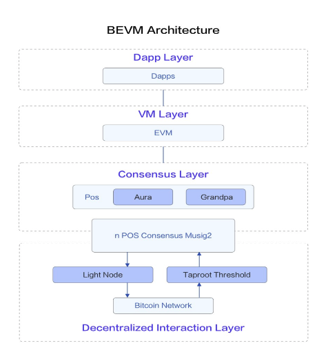
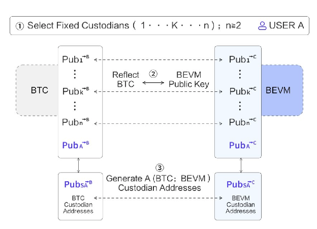

# BEVM

As part of the BTC L2 research series, this article will provide a detailed introduction and analysis of the technical architecture of BEVM, and comprehensively organize information about BEVM.

## Overview and Vision

BEVM is a BTC L2 project compatible with EVM, claiming to achieve fully decentralized cross-chain management, and uses BTC to pay for L2 transaction Gas fees. BEVM officially states that it fully complies with the three major standards of Bitcoin Magazine for Bitcoin L2s.

The core technical architecture of BEVM is named Taproot Consensus, which includes Bitcoin Taproot-related technologies, BTC light nodes, and the Substrate blockchain development framework. Taproot Consensus can achieve more decentralized L2 cross-chain capabilities, as well as an EVM-compatible virtual machine.

BEVM aims to expand BTC, make it possible to issue Bitcoin assets and develop decentralized financial applications, thereby promoting the development of the Bitcoin ecosystem. BEVM also has long-term plans for technologies such as ZK-STARK Ultra Light Nodes, BEVM Stack, DBFX Protocol.

BEVM mainnet went live at the end of March 2024.

## Protocol Overview

BEVM Technical Architecture
BEVM has named its core technical architecture Taproot Consensus, which is implemented using the following technologies:

1. Taproot-related technologies, including Musig2, MAST, Schnorr signatures, etc.
2. A BFT PoS network composed of Bitcoin light nodes. This network is developed using the Substrate blockchain framework, which combines Aura block production consensus and Grandpa BFT consensus.
3. Threshold Nodes that use Signal Protocol for secure communication.

In summary, BEVM is composed of a cross-chain bridge + PoS consensus EVM sidechain.

### Cross-Chain Bridge

The cross-chain bridge consists of a multisig account implemented by Bitcoin's Musig2 protocol and MAST + Bitcoin light node (SPV) network. The multisig account is responsible for managing users' cross-chain assets and data, while the light node network is responsible for verifying Bitcoin transactions and data, and sending back cross-chain transactions.

BEVM uses the new technologies brought by the Taproot upgrade, Musig2 and MAST, to implement a multisig account. The official claims it supports up to 1000 participants, each of whom is a BEVM network PoS consensus node (not an individual or entity), achieving a higher degree of decentralization through this method.

Specifically, each PoS consensus node has a private key used for the BTC network, and each private key on the BTC network has a public key. Using the features of Schnorr signatures, any number of public keys can generate a multisig address through the Musig2 algorithm, and then overlaying MAST technology can achieve m-n multisig.

#### Crossing In

When users transfer BTC or data to BEVM, they need to send a transaction to the multisig account. Each PoS node in the BEVM network, also a BTC light node, synchronizes the block headers of the Bitcoin network, as well as the related cross-chain transactions. Through this information, the success of the cross-chain transaction can be verified, and once confirmed, the corresponding amount of BTC assets will be minted on the BEVM network.

#### Crossing Back

When users wish to cross back assets from BEVM, they need to initiate a cross-back request transaction in BEVM first, then the PoS consensus nodes will vote on the request. When the vote is passed by 2/3 of the nodes, the nodes send a BTC transaction through SPV, transferring the BTC assets or data back to the user's wallet.Generating a cross-back transaction signature by 2/3 of the nodes is a complex process. BEVM uses the Musig2 scheme, which can be completed with just two rounds of communication between nodes. BEVM solves the security issue of node communication through the Signal Protocol.

### EVM Chain

The EVM chain is built using the Substrate blockchain framework and is a PoS network using a BFT algorithm. Each of BEVM's PoS nodes is also a BTC light node used to verify Bitcoin data and send Bitcoin transactions. Specifically, this consensus combines the Aura block production consensus and Grandpa BFT consensus.

According to BEVM officials, BEVM's PoS consensus will support the staking of BEVM tokens and BTC, which will provide security for BEVM's L2.

L2 transaction fees (BTC Gas) will be rewarded to PoS nodes (specific reward details are pending), and the network will also issue new BEVM tokens to incentivize PoS nodes and stakers.

BEVM's mainnet has been live since the end of March 2024, with an average block time of 6 seconds, and the block explorer isavailable at https://explorer.bevm.io. But currently, the PoS consensus is not open for free participation; instead, it is participated by the team, leading investment institutions, and well-known node providers, and it is still in a state of centralized management.

The EVM chain is built using the Substrate framework, which means that BEVM also supports the Substrate API, as well as related wallets and tools.

## Trust & Safety

BEVM's cross-chain solution has made significant improvements compared to ChainX, not only greatly increasing the number of participants in multisig but also integrating BEVM's PoS consensus network, which greatly enhances the decentralization of the cross-chain bridge.

However, according to the cross-chain bridge threshold multisig scheme (Musig2+MAST) described in the BEVM whitepaper, due to the limitations of Bitcoin blocks and the number of MAST leaf nodes, it is not feasible to reach 1,000 participants. Theoretically, it would be around 100 participants, and practically only a few dozen participants might be involved.

Additionally, the multisig account address is ultimately generated or determined by the addresses of the participants, and cannot support dynamic changes in participants. This means that if there are changes in the PoS consensus nodes, the multisig address of the cross-chain bridge will also change. This not only involves the issue of changing the multisig account and transferring assets but also has a significant negative impact on the user experience.

BEVM's use of Taproot-supported multisig + PoS consensus does improve the decentralization and security of the cross-chain bridge to some extent, but the current PoS network still uses a centralized management approach. Whether it will open up for free participation in the future remains to be seen.

Additionally, if the entire L2 goes down, users would presumably be unable to retrieve their assets, but the BEVM team has indicated that there would be contingency plans, the specifics of which are unknown.

BEVM claims not to be a sidechain because its network nodes are also SPVs. If the BTC network goes down, BEVM would also be unable to operate normally, but BEVM does not share the security of the Bitcoin network.

## Misc

1. There are two networks, Canary and Mainnet. Canary serves as a pre-release network, but the assets on it are real BTC.
2. According to community members, BEVM will soon support the cross-chain transfer of assets such as BRC20 and rune to BEVM, though the specific timeline has not been determined.
3. Long-term planning includes ZK-STARK Ultra Light Nodes, BEVM Stack, DBFX Protocol, etc.
4. The BTC Gas fees collected are used not only to reward PoS nodes but also to incentivize stakers on bido.
5. The BEVM token is expected to be launched on October 1st, at which time its detailed economic whitepaper will also be released.
6. Supports the 1559 mechanism, but how the burnt BTC Gas is handled remains unknown.
7. Block space is dynamically adjustable, and official technicians claim that the TPS can reach around 300.
8. According to the official mod, the cross-chain bridge's cross-in (one block transfer confirmed by three blocks) and cross-out times are approximately 30-60 minutes, and crossing out requires the payment of a BTC transaction fee.

## Advantages and Disadvantages

BEVM's numerous features align well with the standards for a Bitcoin L2, not only enhancing the decentralization of the cross-chain bridge but also bringing the EVM virtual machine to the BTC ecosystem, which opens up considerable potential for the expansion of BTC applications.

However, BEVM still has many aspects to prove, such as the ultimate evolution of the L2 network to run entirely on PoS consensus, which will require time to demonstrate the security of the cross-chain bridge. Moreover, the development of L2 is not just a technical issue; BEVM is still relatively behind in terms of community and ecosystem development, and breaking through is not a simple task.

## Protocol Details

### Predecessor: ChainX

BEVM's predecessor, ChainX, began exploring BTC scalability projects in 2017. The ChainX-Network is an independent sidechain + cross-chain bridge separate from BTC, which does not have VM capabilities (does not support smart contracts). The BTC transferred via the cross-chain bridge could only be used for transfers. The bridge utilized Bitcoin's multisig scripts for implementation, supporting a maximum of 15 multisig participants, which is relatively centralized. This project launched in March 2018 and managed to cross-chain a total of 100,000 BTC, though it is less well-known compared to the Lightning Network and RGB.

With the evolution of Bitcoin technology (Taproot upgrade) and the development of the Bitcoin ecosystem in 2023 (Ordinal, BRC20, etc.), the team reflected on and adjusted Chain-X, making the following three improvements:

1. EVM Compatibility: To provide space for the development of more applications, and to reuse tools and codes from the Ethereum ecosystem.
2. Using BTC to Pay Gas Fees: Assigning more usage scenarios to Bitcoin.
3. Adopting a More Decentralized Cross-Chain Solution: Utilizing new features brought by the Taproot upgrade.

### Taproot Upgrade

Taproot is another significant soft fork upgrade for Bitcoin following Segregated Witness, which was activated in September 2021. It primarily includes three BIPs:

1. [BIP340-Schnorr signatures](https://github.com/bitcoin/bips/blob/master/bip-0340.mediawiki): A new signature algorithm that retains all the properties of ECDSA signatures, with provable security, smaller size, and more efficient verification. More importantly, Schnorr signatures are linear, which facilitates convenient key aggregation.
2. [BIP341-Taproot: SegWit version 1 spending rules based on Taproot, Schnorr signatures, and Merkle branches.](https://github.com/bitcoin/bips/blob/master/bip-0341.mediawiki): Spending rules for Segregated Witness version 1. These rules are composed of Merkleized Abstract Syntax Trees, Taproot, and Schnorr signatures, making Bitcoin's multisignature more private and efficient.
3. [BIP342-Validation of Taproot Scripts](https://github.com/bitcoin/bips/blob/master/bip-0342.mediawiki): This BIP modifies some of Bitcoin's opcodes and introduces new ones to support the validation of Taproot scripts.

The Taproot upgrade brings several improvements to Bitcoin, including enhanced privacy, higher efficiency, and greater scalability. An important application of this is the `Taproot threshold signatures.`

## Summary

BEVM is a typical representative of BTC L2 compatible with EVM. Functionally, it is similar to other L2 projects based on ZK Rollup, Op Rollup, or other EVM-compatible technologies. The key to such projects lies in the security and decentralization of the cross-chain bridge, and BEVM has certainly made efforts in this area. Whether an L2 can stand out ultimately depends on the development of its community and ecosystem. BEVM still has much work to do in this regard. We will continue to monitor the future development of BEVM.

## References

1. [Musig2 Paper](https://eprint.iacr.org/2020/1261) and related [BIP-327](https://github.com/bitcoin/bips/blob/b3701faef2bdb98a0d7ace4eedbeefa2da4c89ed/bip-0327.mediawiki#L3)
2. [BEVM whitepaper](https://github.com/btclayer2/BEVM-white-paper/blob/main/BEVM%20%E2%80%94%20An%20EVM-compatible%20Bitcoin%20Layer%202.pdf)
3. [比特币 Layer2 跨链桥多签资产托管案例解析](https://foresightnews.pro/article/detail/55469)
4. [Taproot Upgrade explain](https://www.btcstudy.org/2021/11/02/the-taproot-upgrade-explainer-from-Suredbits/)
5. [Taproot Consensus: A BTClayer2 technological solution developed by BEVM](https://bevm-blog.webflow.io/post/taproot-consensus-a-btclayer2-technological-solution-developed-by-bevm)
