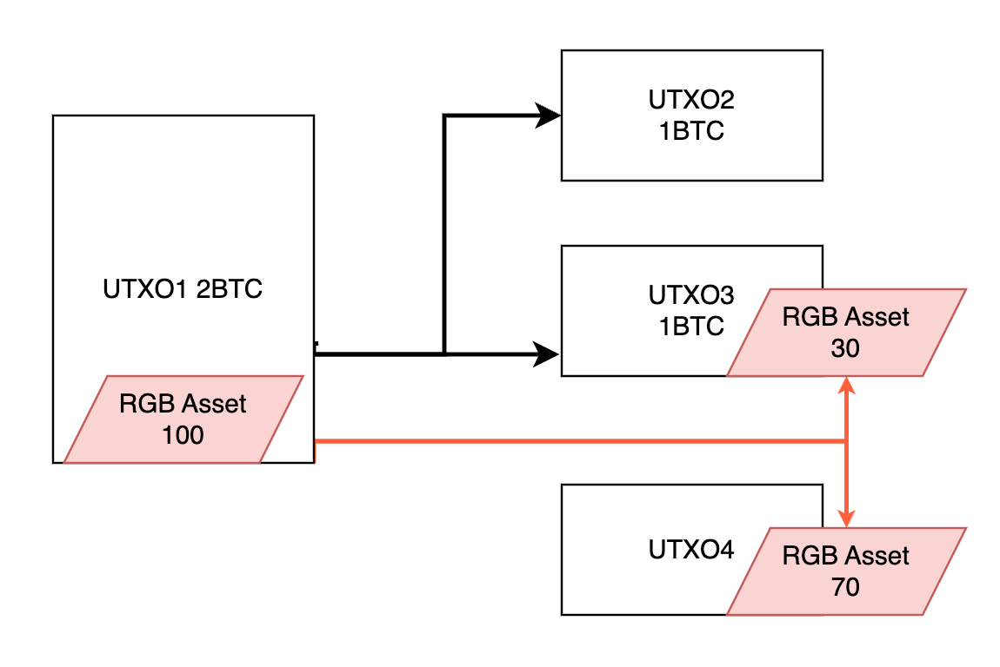
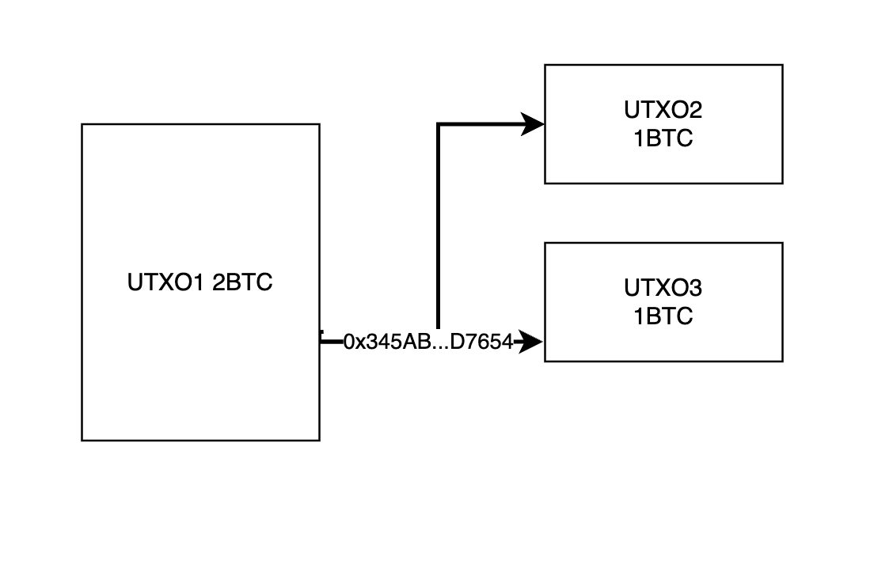
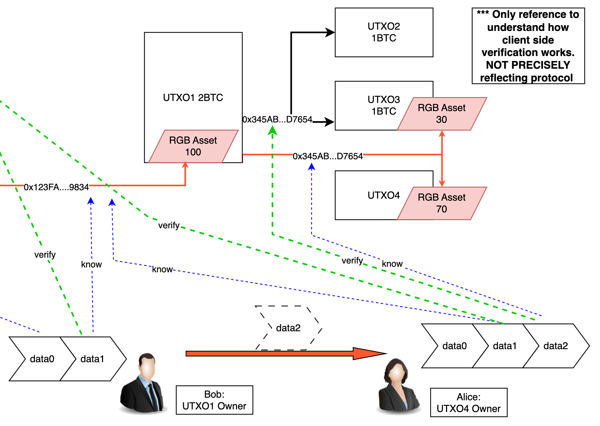
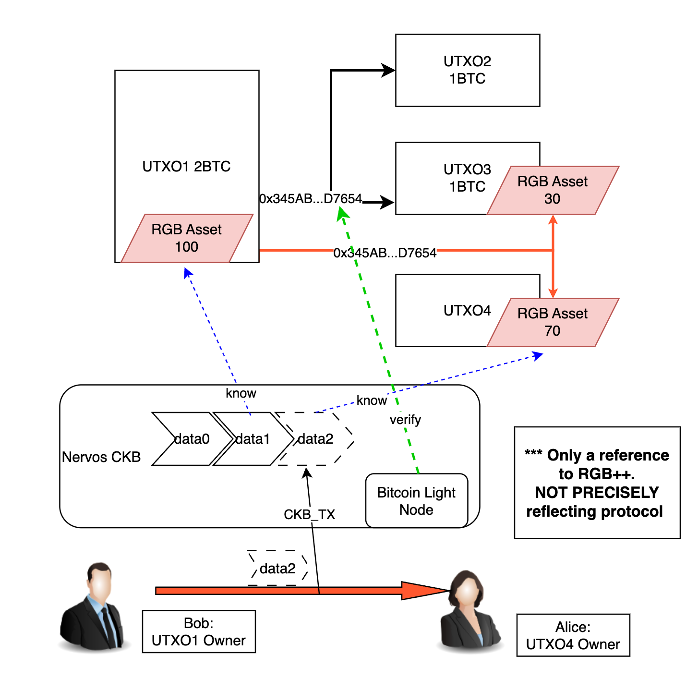
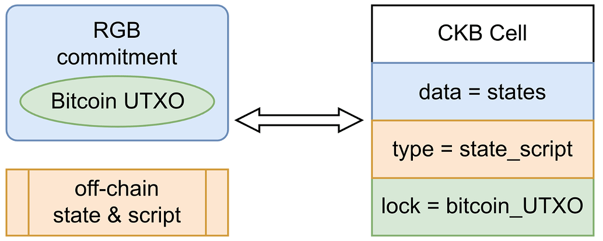
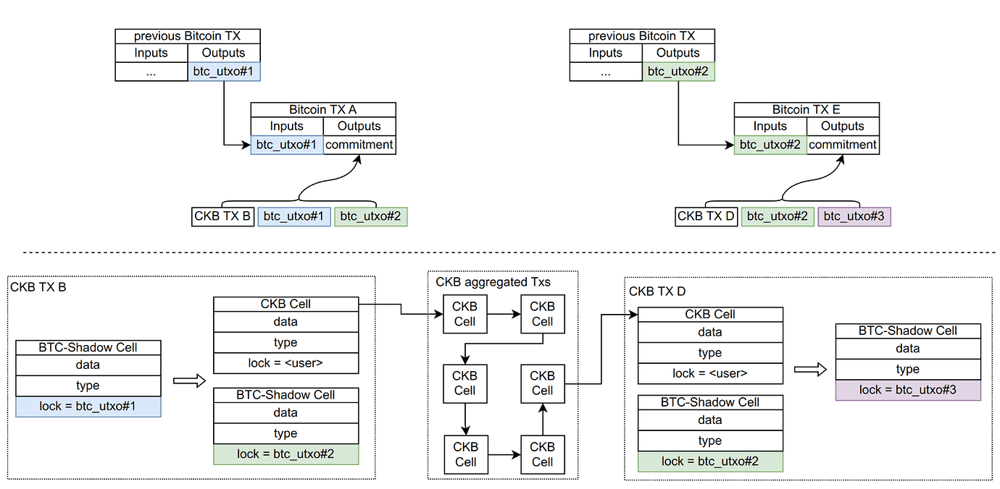
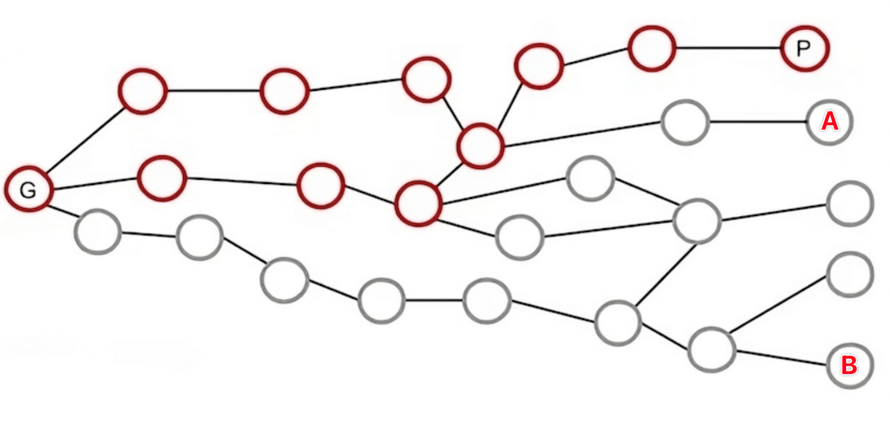

## RGB
### Overview and Vision

RGB is a cutting-edge smart contract platform that leverages the Bitcoin blockchain to enable the execution of smart contracts. It operates through a paradigm of client-side validation, ensuring that data is stored off the main blockchain and ownership managed with the robust security of Bitcoin scripts. This innovative approach aims to offer an advanced alternative to traditional Ethereum-based smart contract systems.

By decoupling the roles of contract issuers, owners, and the evolution of contract states, RGB creates a multi-layered ecosystem that is not only scalable and private but also highly secure for managing digital assets and developing decentralized applications.

### Quick Scan for RGB

> In this section, we'll focus on the essentials and keep the technical details to a minimum, making the protocol's workings easy to understand.

#### The Basics

> Unspent Transaction Outputs (UTXOs) are a core concept in the Bitcoin universe. If you're new to this term, you can dive deeper with this [wiki entry](https://en.wikipedia.org/wiki/Unspent_transaction_output). For now, let's keep the explanation high-level.

RGB's design as a smart contract platform is intricately linked with UTXOs. To illustrate, imagine 100 units of an asset being issued on the RGB platform. These assets are then tied to a specific UTXO. When the UTXO owner spends that UTXO, he(or she) can dictate the flow of RGB assets within the transaction (this mechanism known in RGB as **ownership**). The diagram below provides a visual:



UTXO1 holds 100 RGB assets. Once spent, it transforms into UTXO2 and UTXO3 (indicated by black arrows). The transaction also outlines the transfer of RGB assets (red arrows), splitting the 100 units into 30 and 70 portions, respectively linked to UTXO3 and UTXO4.

> The RGB contracts are designed for versatility, allowing the logic to be independent of UTXO transactions. This means that the movement of RGB assets isn't necessarily tied to the spending of UTXOs.

Given that a UTXO can only be spent once, any RGB assets associated with it can only be transferred once as well. The security of Bitcoin ensures that UTXOs are safe from double-spending, and by extension, so are RGB assets, safeguarding the integrity of the protocol.

> This innovative approach is known in the RGB protocol as [single-use seals](https://blackpaper.rgb.tech/consensus-layer/3.-client-side-validation/3.2.-single-use-seals).

#### Indicating RGB Operations on Bitcoin

To maintain privacy and enhance the capabilities of smart contracts, RGB doesn't etch operations in plain text on the Bitcoin script. Instead, it submits a hash value associated with the actual operation to the blockchain (referred to as a "commitment"). The RGB protocol's participants can then validate whether the commitment on the blockchain matches the intended operation off the chain.

> We won't delve into the mechanics of how commitments are submitted here. However, it's important to note that a corresponding commitment value will always be present on the blockchain.

This approach ensures that RGB transactions are private. Non-participants of the RGB protocol can only see the following on-chain behavior:



As the hash value cannot be reversed to reveal the original RGB operation, those not involved with RGB transaction remain unaware of the assets' existence.

Moreover, since only the hash value of the operation is recorded on the blockchain, the data size submitted is consistently small. This approach enables complex off-chain operations while incurring only a minimal cost.

#### Client-Side Verification

At the heart of RGB's security lies the submission of hash values to the blockchain. The process of verifying these hashes during transactions is crucial. RGB employs a strategy known as "client-side verification" to maintain the integrity of transactions. All data associated with RGB is stored off-chain, where it is managed by the parties involved in the transaction. These parties are responsible for the transmission of data, and upon receipt, they can verify the transaction's legitimacy on their local client.

Let's look at a simplified illustration to understand the role of client-side verification (**please note: this illustration is not an exact representation of all the intricacies of the RGB protocol**).



Using the example from the [Basic Operation](#the-basics) section, Bob, the owner of UTXO1, wishes to transfer 70 RGB assets to Alice, who holds UTXO4.

- In the course of the transaction, additional data, `data2`, is created, and Alice receives all the data from Bob, including `data0`, `data1`, and the newly generated `data2`.
- By examining the RGB data (`data0`, `data1`, and `data2`), Alice can track the status changes of the RGB assets (the blue dotted line).
- Alice then checks for the presence of a hash of the RGB data (`data2`, `data1`, etc.) on the blockchain and confirms whether the associated transaction has been validated by the Bitcoin network, thus ensuring the data's authenticity (the green dotted line). Alice must confirm the validity of all RGB data from the deployment of the contract (corresponding to the on-chain transaction of `data0`, not depicted in the illustration) up to the most recent transaction. Bob performs an identical verification process upon Alice's receipt of the assets.

The client's approach to privacy is quite stringent. It's worth noting that even the original deployer of the RGB contract, without access to `data2`, would be unable to discern the transaction between Bob and Alice.

### Trust and Security

> Given the significance of security, we will discuss the various components of the protocol and applications that users must place their trust in, providing an analysis from the perspective of "trust."
>
> Unless stated otherwise, we assume that the basic cryptographic algorithms used within the protocol are reliable, disregarding the potential impact of quantum computers.

- Users must trust the Bitcoin network.
  - Transactions on the Bitcoin network should be secure from double-spending; otherwise, RGB assets could also be at risk.
  - Bitcoin transactions should remain uncensored; otherwise, RGB transactions might be blocked from being added to the chain.
- Users should trust the off-chain execution mechanism of RGB, including the virtual machine and the design of smart contracts. RGB assets are linked to UTXOs, and while only hash values of RGB operations are submitted to the blockchain, there is no direct interaction with Bitcoin scripts. Consequently, the blockchain cannot confirm the validity of RGB transactions in any way. If the off-chain execution mechanism encounters an error (such as a coding mistake in the engine or a flaw in the contract logic), it could result in the creation of invalid states off-chain or a discrepancy between the submitted hashes and the actual RGB status. In such cases, once the UTXO transaction is spent, the state in the user's possession may not be verifiable, potentially leading to a loss of assets.

The RGB protocol minimizes the trust required from users. Users can independently verify nearly every aspect of the protocol to ensure its proper functioning. However, this also imposes certain responsibilities on the users that they need to perform quite heavy data storage and verification locally.

### Additional Information

#### Virtual Machine

RGB has developed a Turing-complete virtual machine known as [AluVM](https://www.rgbfaq.com/glossary/aluvm), enhancing its capabilities.

#### Scalability

RGB transactions are tied to Bitcoin transactions, which can affect the system's throughput. To address this, the [Bifrost protocol](https://www.rgbfaq.com/glossary/bifrost) has been introduced as an enhancement to the Bitcoin Lightning Network, facilitating RGB payments through the network.

#### TVL

Given the privacy features inherent in RGB, tracking Total Value Locked (TVL) is not feasible with current methods.

### RGB Overview: Pros and Cons

Pros:

- Privacy: RGB submissions on the chain are limited to hashes, ensuring transaction privacy through a system of client-side verification. Only the parties involved in the transaction have access to its details.
- On-chain costs for complex contracts: Since only hash values are submitted to the chain, the associated on-chain costs are decoupled from the complexity of the contract.
- Trust: The protocol demands minimal additional trust; users have the means to verify nearly every aspect of the protocol.

Cons:

- Data storage: Users are responsible for storing RGB data associated with their transactions. If this data is lost, it can result in the loss of assets.
- Transactions necessitate coordination among multiple parties. If a party is offline, the transaction cannot proceed, complicating client design.
- High verification costs: With each transaction, clients must perform state verifications. As transaction volume grows, the associated verification burden can become significant, potentially increasing local storage requirements or network costs when interacting with RPC nodes or other services.

These challenges associated with RGB can increase the complexity of client development and raise the barrier for user adoption.

### More Details

> In this section, we will delve into aspects of the protocol that are less critical but still important for readers who wish to understand the technical intricacies.

#### State Machine Replication and Off-Chain Computing Engines

A fundamental challenge in blockchain technology revolves around ensuring that all nodes maintain a consistent ledger. We'll begin by discussing a widely adopted approach known as "state machine replication", which is used by Bitcoin and other blockchains to achieve fault tolerance. This method is extensively utilized in distributed systems to address the issue of consistency across multiple copies. For instance, both distributed databases and blockchains operate based on this principle. The process is straightforward:

1. Each copy is initialized as a specific state as the starting point.
2. State transitions occur as follows:
   1. Before receiving new input, the state of each copy remains unchanged.
   2. Upon receiving input `i` in state `s`, the copy moves to a new state `s'`. This transition is deterministic, meaning that given the same input `i` and state `s`, the resulting state `s'` will be consistent across all copies.
3. By ensuring that all copies begin with the same initial state `s0` and process the same inputs (`i0`, `i1`, `i2`...`in`) in the same order, their final states will align.

In the context of Bitcoin, we refer to this "state" as all the Unspent Transaction Outputs (UTXOs) within the system.

1. Every Bitcoin node begins with the genesis block as its starting state.
2. State transitions are handled as follows:
   1. The ledger's state remains unchanged until a new transaction (block) is received.
   2. Upon the reception of a new transaction (block), the ledger transitions to a new state. This process is deterministic; given the same ledger state and transaction (block), the resulting ledger state will be consistent.
3. By following this method, as long as all nodes start with the genesis block and process transactions (blocks) in the same sequence, their respective ledger states will eventually match.

The key challenge lies in ensuring that all nodes agree on the order of transactions (blocks), which is the essence of consensus and the foundation for preventing double-spending attacks in blockchain.

The off-chain computing engine of RGB leverages Bitcoin's consensus mechanism to maintain the order of transactions, thereby preventing double-spending. States and transitions are managed off the main blockchain. This approach has the advantage of separating the execution layer from the consensus layer, allowing for functional expansion without the need for blockchain upgrades. However, this also means that the consensus layer does not perform logical validation during transactions. If the data submitted to the blockchain conflicts with the logic of the off-chain transaction engine, the transaction will not be rejected, potentially leading to asset loss. Some may argue that RGB is "parasitic" on Bitcoin, but it can also function on other blockchains that use UTXOs.

Protocols like Inscription and Rune follow a similar model but face the additional challenge of a lack of standardized implementation in the ecosystem's early stages. With different implementations of off-chain execution engines (indexers), verifying the results can be difficult.

#### Commitment Schemes

Commitment schemes are cryptographic concepts that allow an individual to commit to a value, hide it initially, and later reveal it. These schemes have two fundamental properties:

- The committed value corresponds to a SINGLE original value. In RGB, a commitment on the blockchain corresponds to a unique operation, ensuring that double-spending is prevented. This property is known as binding.
- It is impossible for others to deduce the committed value from the commitment. In RGB, observers cannot determine the specific operation associated with a commitment on the blockchain, preserving privacy. This aspect is referred to as hiding.

Hashing is a frequently used technique for designing commitment schemes. For example, the Merkle Tree, a well-known concept in blockchain technology, is a type of commitment scheme. Commitments are also commonly used in other blockchain applications, such as the two-stage registration process in ENS, which helps prevent others from front-running to register domain names.

#### Proof of Publication

A concern in RGB's client-side validation could be that transaction participants may not have access to the overall state of assets. For example, while Bob may hold 100 assets, there could be 200 assets in circulation. How does the system ensure that contract execution does not lead to issues under such circumstances?

RGB addresses this issue with a concept known as "proof of publication". The central idea is that state verification in distributed systems does not require global execution by all participants. Instead, it involves the relevant parties verifying specific state transitions. In this approach, state transitions are not broadcast globally but are encoded into a brief cryptographic commitment once the involved parties acknowledge the change (e.g., through signatures). As illustrated in the diagram below, while contract G's overall state includes all red and gray nodes (representing historical transactions), verifying the state of node P only requires examining the relevant red nodes.

It's important to note that this design also imposes certain requirements on the design of smart contracts.


### Related Resources

- [RGB Blackpaper](https://blackpaper.rgb.tech/)
- [RGB Website](https://rgb.tech/)
- [CoinEx Research: A Brief Analysis of RGB: A Scalable, Confidential Smart Contract Protocol Built on Bitcoin](https://www.coinex.com/en/blog/3654-a-brief-analysis-of-rgb-a-scalable-confidential-smart-contract-protocol-built-on-bitcoin)
- [RGB Presentation Slides](https://github.com/LNP-BP/presentations/tree/master/Presentation%20slides)

## RGB++

### Overview and Vision

RGB++ is an extension of the RGB protocol, introduced by the Cipher from Nervos CKB team. Nervos CKB is a public blockchain that utilizes a UTXO-based model, referred to as "Cells" within its framework. Building upon the RGB protocol, RGB++ maps RGB UTXO structure to Nervos CKB's Cells, leveraging script constraints on both the CKB and Bitcoin networks to ensure the accuracy of state computations and the legitimacy of ownership transfers. The goal of RGB++ is to address the technical challenges faced by the original RGB protocol in real-world scenarios by offloading the client-side workload onto the CKB blockchain.

### Protocol Overview

> To keep things accessible, we will avoid delving into the complex technicalities of the protocol in this section. Instead, we will explain the protocol's operation in a straightforward manner.

#### How It Works

As an extension of RGB, it is advisable to familiarize yourself with the RGB protocol before proceeding. The essence of RGB++ is the shift from the traditional client-side validation approach to a model where all data is openly published on the Nervos CKB blockchain, with CKB serving as the execution engine. We will continue to use an example from the RGB protocol to illustrate this, as depicted in the figure below (*Please note: This figure is a simplified representation of RGB++'s basic functioning for illustrative purposes only*).



In the example, Bob is transferring 70 RGB assets to Alice. Unlike the previous client-side verification, all RGB-related data is now publicly available on the CKB chain, with CKB taking on the role of the execution engine to manage and maintain the RGB contract state.

- Bob can easily verify through Nervos CKB that he has 100 RGB assets associated with his UTXO1.
- When Bob sends assets to Alice, there is no need to share data0 and data1 with her; Alice can independently access the current contract state or historical data on the blockchain.
- Once the Bitcoin transaction that includes the commitment(0x345AB...D7654) is confirmed, Bob can submit a transaction with the RGB data (data2) to CKB. CKB nodes, running a lightweight version of the Bitcoin node, will verify the existence of the commitment on the Bitcoin network.
- After CKB processes the transaction, Alice can see that she now holds 70 RGB assets on her UTXO4.

As a result, the CKB chain now handles the majority of functions previously managed by the client in the RGB protocol. This transition significantly reduces the data storage and verification burden on users. However, this approach does come with a trade-off: the level of privacy inherent in the original RGB protocol is diminished.

### Details for Transaction Process

The [white paper](https://github.com/ckb-cell/RGBPlusPlus-design/blob/main/docs/light-paper-cn.md) of the RGB++ protocol offers an in-depth explanation of the transaction process, which we will use here, complemented by the above diagram.

- Off-chain Computing
  - Bob chooses the next UTXO to be used for the BTC transaction, such as UTXO1.
  - Bob performs off-chain computing to create an RGB++ transaction for submission to the CKB network: CKB_TX. This transaction includes the necessary data for changes in the RGB state.
  - Bob calculates an off-chain commitment value `commitment`(0x345AB...D7654).
- Submission of BTC Transaction
  - Bob creates and dispatches a Bitcoin transaction that spends UTXO1, incorporating the aforementioned `commitment`(0x345AB...D7654) through an OP_RETURN operation.
- Submission of CKB Transaction
  - Bob submits `CKB_TX` to the CKB network.
  - The most recent user state is preserved in `CKB_TX.output.data`.
  - The subsequent state change (by Alice) will require UTXO4 and the output of `CKB_TX`.
- Chain Verification
  - The Bitcoin UTXO1 is utilized only once.
  - Through a Bitcoin Light Node, CKB verifies the commitment value on the Bitcoin network and ensures that the appropriate UTXO has been spent.
  - CKB confirms that the contract's state transition on its network adheres to the predefined contract rules.

### Trust and Security

> Since "security" is a critical issue, we will analyze from the perspective of "trust" the components of the protocol and applications that users need to have confidence in, and provide an analysis. Unless otherwise mentioned, we consider the classic cryptographic algorithms used in the protocol to be trustworthy (not considering quantum computers).

- Users must trust the Bitcoin network.
  - Transactions on the Bitcoin network must not be double-spent; otherwise, RGB(++) assets would also be at risk of double-spending.
  - Transactions on the Bitcoin network must not be censored; otherwise, RGB(++) transactions might not be able to be recorded on the blockchain.
- Users must trust the transaction execution mechanism of the CKB network for the same reasons as with RGB.
- Users must trust that the CKB network will access recent Bitcoin transactions for verification. Otherwise, illegal states might be recorded on the blockchain.
- Users must trust that the CKB network will not censor their transactions. If a user's transaction is censored and cannot be recorded on the blockchain, they will not receive the results of the transaction execution. However, in such cases, the protocol can revert from RGB++ back to RGB, re-enabling the client-side validation paradigm to compute transaction results offline.
- Users must have a certain level of trust in the consistency of the CKB network (consistency can be understood as whether confirmed transactions will be rolled back).
  - Corresponding to the commitment on Bitcoin, malicious attackers cannot construct another CKB transaction containing different execution content. Users do not need to worry about double-spending of RGB assets due to inconsistencies on the CKB network.
  - However, users should consider that if the CKB network experiences a rollback, it could result in the loss of transaction data. If users have not saved the relevant transaction data, this could potentially lead to the permanent loss of RGB++ data.

It should be noted that the above trust analysis does not take into account the extended features planned by the RGB++ project, such as "transaction folding" and "global state cells".

### RGB++ Summary: Advantages and Disadvantages

RGB++ is an extension to RGB, let's analyze the strengths and weaknesses of RGB++ in comparison to its predecessor.

Advantages:

- Users are no longer required to store data themselves; CKB takes care of data hosting.
- The majority of the runtime environment's responsibilities are handled by CKB, allowing users to access the most recent state of the RGB contract directly from the CKB chain without the need to initiate the entire RGB data process each time.
- CKB verifies transactions automatically through Bitcoin lightweight nodes, eliminating the need for users to conduct their own verification.

Disadvantages:

- Transaction privacy is compromised.
- Execution of complex transactions is restricted, as transactions must be processed on CKB. Additionally, transaction fees must be paid based on the complexity of the transactions.
- Extra trust shall be put on CKB chain.

While RGB++ does not wholly retain the advantages of RGB, it does significantly enhance the usability of the protocol by sacrificing some privacy and requiring a degree of additional trust from users.

As a scalability solution for Bitcoin, the advantages and disadvantages of RGB++ are as follows:

Advantages:

- Trust: The CKB chain acts as a public computing engine beneath the Bitcoin chain, taking on the responsibility of verifying and executing the protocol without the need for cross-chain bridges. The additional trust required by the protocol is minimal, allowing users to easily ascertain whether the CKB chain is acting maliciously, with the option to revert to client-side verification if necessary.

Disadvantages:

- The solution does not effectively address the issue of scalability. (The transaction folding proposed in the RGB++ Light Paper can somewhat mitigate this issue; for further information, readers are encouraged to explore the subsequent content.)

### For More Details

> In this part, we'll cover aspects of the protocol that are less critical but still worth exploring for those who are curious about the technical intricacies.

#### [Isomorphic Binding](https://talk.nervos.org/t/rgb-protocol-light-paper/7733#rgb-5)

We haven't delved into the specific architecture of Nervos CKB in the previous sections. Other blockchains, like the Turing-complete EVM-compatible chains, can also achieve similar functionalities. A concise discussion on this topic can be found in the appendix.

The CKB's ability to act as the RGB computation engine is greatly enhanced by the isomorphic nature of its Cells to Bitcoin(RGB)'s UTXOs. This allows CKB to adopt many designs from the RGB protocol, such as the proof-of-publication mechanism, which helps to prevent state contention and enables RGB computations to be performed offline, reducing reliance on the CKB chain.



#### [Transaction Folding](https://talk.nervos.org/t/rgb-protocol-light-paper/7733#h-13)

With RGB++, it's possible to make a commitment on Bitcoin for multiple CKB transactions instead of just one. This approach can create a ROLLUP-like effect, improving the system's scalability.



#### Shared State and Its Security Risks

To boost the contract's capabilities, RGB++ introduces the concept of "global state cell". The "Shared State and Unhosted Contracts" white paper by RGB++ explains this feature:

> Consider a global state cell on the CKB that manages the state shared by multiple users. Typically, it could be a staking contract for an algorithmic stablecoin, where users deposit volatile assets and receive a deposit proof. The global state is managed by an unhosted contract, meaning anyone can make changes to the state without requiring specific digital signatures from designated signatories. The implementation of an unhosted contract plays a crucial role in the decentralization and censorship resistance of the protocol.

> A mediocre implementation in this context means that there is a risk that the Global state Cell is occupied by another user, causing CKB TX fail because the specified Global state utxo does not exist. As the Bitcoin TX needs to be sent out and computed into the commitment before the CKB TX, subsequent validation becomes impossible.
>
> To address the above problem, we introduce the Intent Cell as an intermediary. Users can deterministically write down actions they wish to execute into the Intent Cell, which can interact with the global state Cell through the collaboration of a third-party aggregator, batch processing multiple parties’ intent and merging the results of the interaction into a standard shadow cell.

This approach, however, introduces potential security concerns. The proof-of-publication design in RGB only guarantees a partial order of state transitions, not a total order, which is sufficient for protocol security.

When elements like the global state are introduced, this changes the dynamics, as the revealing order of transactions A and B on different paths can influence the outcome. Consider the following scenario:

1. Both transactions A and B have had their commitments recorded on the BTC chain.
2. The CKB transaction for A has not been recorded due to some issue, such as a censorship attack on the CKB chain.
3. Transaction B has already altered the global state after execution.
4. If transaction A is eventually recorded on CKB, it may yield different results or even fail, potentially leading to asset loss.



The Intent Cell solution presented in the white paper does not fully address this issue. While it ensures that transactions submitted to CKB be executed, it doesn't guarantee that both the execution result of A and B will be as expected. In the original RGB protocal, as long as the client correctly constructs the state transition and commitment, the contract operates as expected. However, in RGB++, the transaction execution result of the commitment made first on Bitcoin is now controlled by CKB, whereas, downgrading the original "Layer1 security". Incorporating the global-state cell into RGB might not be a secure choice.

### Related Resources

- [RGB++ Protocol Light Paper](https://github.com/ckb-cell/RGBPlusPlus-design/blob/main/docs/light-paper-en.md)
- [RGB++ Contract Specification](https://github.com/ckb-cell/RGBPlusPlus-design/blob/main/docs/locscript-design-prd-cn.md)

### Appendix: Discussion on Building an RGB Execution Engine Pseudocode in EVM

We mentioned in the text that a Turing-complete EVM can also serve as the execution engine for the RGB architecture. Below is a ***pseudocode*** implementation of a demo contract to deploy an RGB++-like execution engine on an EVM chain.

BTC_STATE is a specially implemented contract that we assume can (via a lightweight node) read confirmed information on the Bitcoin. At the same time, anyone can manually make a transaction's commitment value public through RGB_CONTRACT's openCommitment function, using the EVM as the execution engine to execute RGB transactions. Here, we assume that the transaction's commitment value is submitted to the chain.

```sol
// BTC_STATE can read the confirmed state of Bitcoin
contract BTC_STATE {
  struct TXO {
    uint256 btcTxId;
    uint256 outputIndex;
  }
  // a Bitcoin transaction will have at most one OpReturn
  function readBitcoinOpReturn(uint256 btcTxId) returns (bytes);
  // or
  function readBitcoinTransactionOutputScript(TXO txo) returns(bytes);

  function isBitcoinTransactionOutputSpent(TXO txo) returns(boolean);
  // ...
  function readBitcoinOrdinalIndex(TXO txo, uint256 satoshiIndex) returns (uint256);
  // ...
  function readBitcoin...(uint256 btcTxId) returns (bytes);
}

contract RGB_CONTRACT {
  struct RGB_DATA {
    TXO input; // could be multiple, only for reference
    TXO output; // could be multiple, only for reference
    bytes payload;
  }
  mapping(uint256 => bytes) utxoStatus;
  mapping(uint256 => boolean) utxoPermission;
  function openCommitment(RGB_DATA calldata data, bytes32 salt) public {
    isValidOpen(data, salt);
    utxoPermission[calcTxoHash(data.input)] = false;
    utxoPermission[calcTxoHash(data.output)] = true;
    execute(data.payload);
  }
  function calcTxoHash(TXO txo) pure returns (uint256);
  function calcCommitment(RGB_DATA calldata data, bytes32 salt) pure returns (bytes32);
  function execute(bytes payload) internal;
  function isValidOpen(RGB_DATA calldata data, bytes32 salt) {
    require(utxoPermission[calcTxoHash(data.input)], "The input utxo should have permission");
    require(
      calcCommitment(data, salt) == BTC_STATE.readBitcoinOpReturn(data.input.btcTxId)
    );
    _;
  }
}
```
