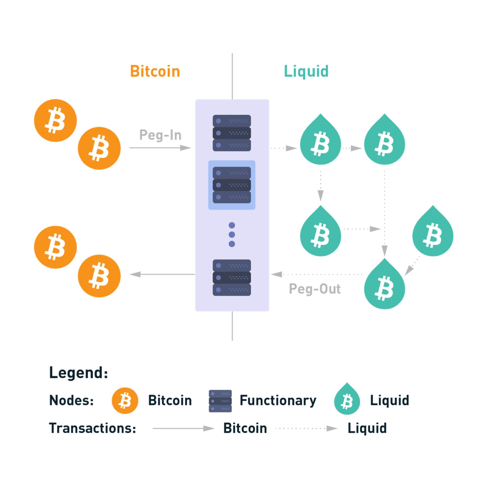
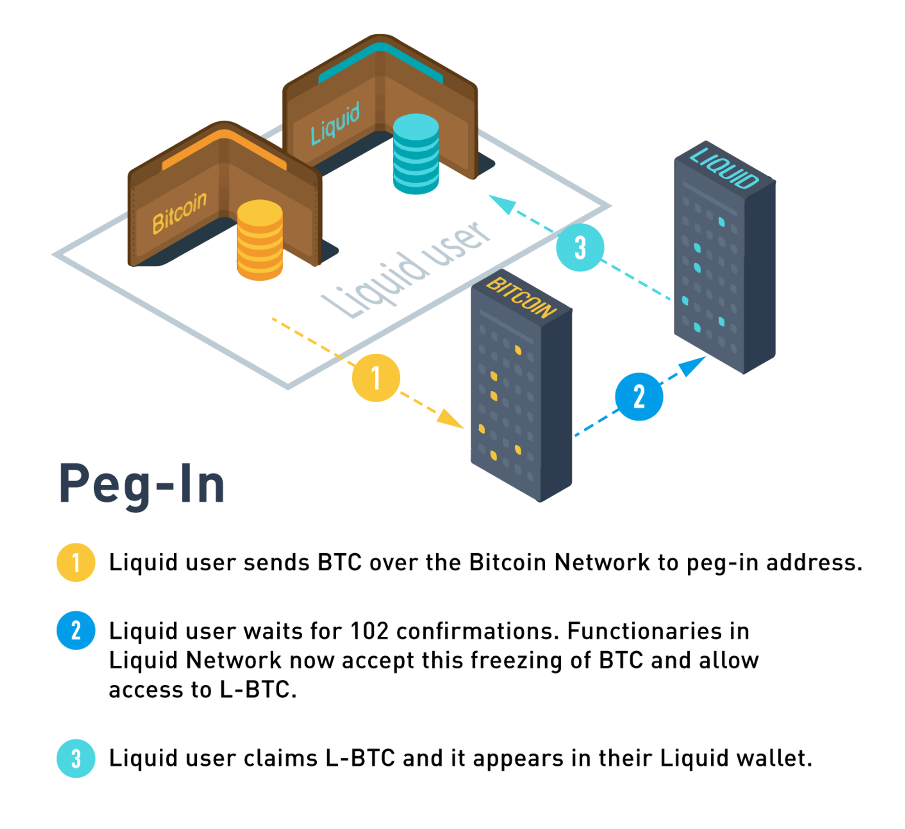
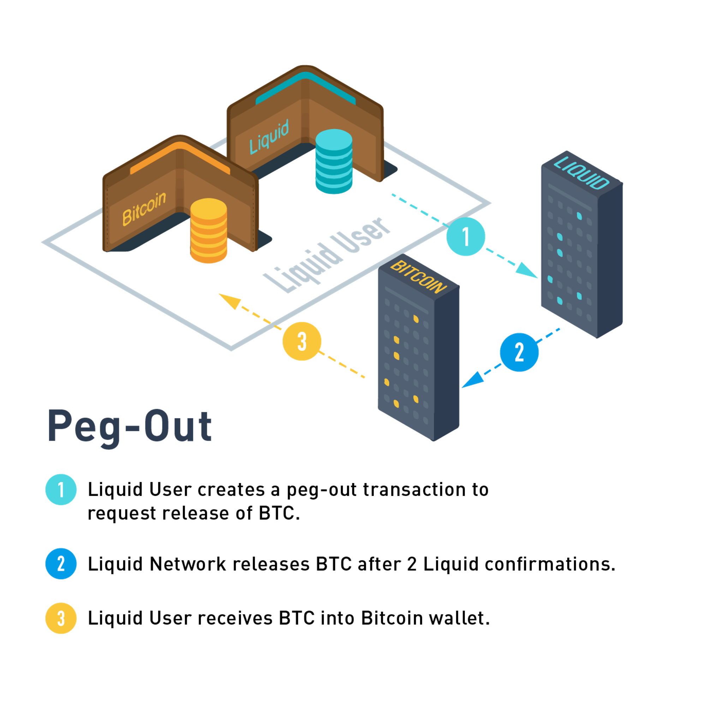

# **Exploring Liquid Network’s Bitcoin Sidechain**

## **Introduction**

This article is part of a series exploring the different scaling solutions built on or around Bitcoin's blockchain. The aim is to provide a comprehensive insight into these protocols, highlighting their functionalities, security features, and their role in the broader cryptocurrency ecosystem. In this edition, we will explore the Liquid Network, examining its design, operation, and its implications for Bitcoin's scalability and privacy enhancements.

## **Overview**

Liquid Network is a sidechain-based settlement network that functions as a Bitcoin Layer-2 solution. It interconnects global cryptocurrency exchanges and institutions, facilitating rapid and confidential Bitcoin transactions along with the issuance of digital assets.

Liquid aims to address some of the limitations of the Bitcoin network by providing faster transaction settlements and enhanced privacy, all while maintaining robust security. It enables the issuance of various types of digital assets which opens new avenues for trading and asset management on its platform.

The network was officially launched in 2018 by Blockstream, and it operates as an implementation of Elements, a sidechain-capable blockchain platform. 

## **Protocol Quick Scan**

The Liquid Network was specifically designed as a sidechain to Bitcoin that aims to address the scalability and privacy limitations of its parent chain. This section provides a concise overview of how the Liquid Network operates, its unique features, and the technical innovations it introduces to enhance transaction capabilities on Bitcoin.

### **Operational Mechanics**

At its core, the Liquid Network facilitates faster and more private transactions through a sidechain mechanism linked directly to the Bitcoin blockchain. Users can transfer Bitcoin into the Liquid Network using a two-way peg, which converts BTC to Liquid Bitcoin (L-BTC) at a 1:1 ratio. This conversion enables the use of L-BTC across Liquid’s ecosystem with all transactions benefiting from the sidechain’s enhanced features like rapid settlement times and increased privacy.

### **Key Differentiators**

**Federated Consensus**: Unlike Bitcoin’s decentralized proof-of-work system, Liquid utilizes a federated consensus model managed by a consortium of trusted functionaries. These functionaries are responsible for maintaining the network’s integrity and security. This model allows for consistent block times and immediate transaction finality, reducing the typical wait times associated with Bitcoin’s block confirmations.

**Confidential Transactions**: Liquid introduces privacy as a core component of its architecture. Through Confidential Transactions, transaction amounts and asset types are obscured, providing privacy for financial transactions while still maintaining the ability to audit and verify transfers securely. This feature is particularly appealing to institutions and individuals seeking privacy without sacrificing transparency.

### **Technical Innovations**

**Liquid’s Two-Way Peg**: The pegging mechanism used by Liquid allows for secure and verifiable movement of Bitcoin between the Bitcoin blockchain and the Liquid sidechain. This peg is crucial for maintaining a trustless exchange environment where users can move assets across blockchains without reliance on intermediary transfer services.

**Speed and Finality**: The network’s design emphasizes speed and reliability. Transactions on Liquid can achieve final settlement within two minutes, a significant improvement over Bitcoin. This is made possible through the streamlined block generation process managed by the functionaries, ensuring that transactions are processed swiftly and without the delays associated with mining on Bitcoin.

**Asset Issuance Platform**: Beyond transacting in Bitcoin, Liquid provides functionalities for issuing a variety of digital assets. These assets can represent real-world entities like fiat currencies or securities, or they can be entirely digital creations such as tokens for specific ecosystems. The issuance process is integrated with Liquid’s privacy features, allowing issuers to maintain confidentiality over the operations while enabling the broad utility of these assets across the network.

## **Trust & Security**
The security framework of the Liquid Network, while bolstering its functionality and performance compared to the traditional Bitcoin blockchain, introduces unique trust dependencies and potential vulnerabilities. This section evaluates these elements critically, examining the implications of potential breakdowns and how they influence the overall integrity and reliability of the network.

### **Trust Dependencies**

1. **Federated Consensus Model**: Liquid’s federated consensus hinges on a pre-selected group of functionaries, which shifts trust from a decentralized model to a more centralized one. While this allows for faster transaction confirmations and improved privacy through Confidential Transactions, it also means that the network's security is heavily reliant on the integrity and reliability of these functionaries. If the functionaries were to act maliciously or if their systems were compromised, it could lead to manipulated transactions or loss of funds.
2. **Functionaries as Block Signers and Watchmen**:
    - **Block Signers**: The entire network trusts these functionaries to propose and sign blocks faithfully. If this trust is misplaced—through internal fraud or external hacking—transactions might be falsely validated or denied, impacting the network's reliability and users' assets.
    - **Watchmen**: They manage the crucial two-way peg that allows BTC to be transferred in and out of the Liquid Network. A failure here, such as improper handling or theft of the pegged BTC, would directly threaten users' assets and could severely undermine trust in the platform's security.
3. **Key Storage Modules**: The security of cryptographic keys is paramount as they underpin all transaction validations on the network. Any breach in these modules could potentially allow unauthorized access to sign transactions or alter the network operations.
4. **Emergency Recovery Procedure**: Trust is also placed in the network's ability to execute emergency procedures effectively in the event of significant disruptions. Failure in these protocols could result in the irrevocable loss of user funds.

### **Analyzing Security Features and Potential Breakdowns**

1. **Confidential Transactions**: While these transactions provide privacy, the obscured data could complicate the auditing process, potentially leading to unnoticed fraudulent activities until they become significant. Moreover, if the cryptographic methods securing these transactions were compromised, it could expose sensitive transaction details to malicious actors.
2. **Strong Federation**: The security model relies on the robustness of the Strong Federation. A breakdown in this federation, such as collusion among a subset of functionaries, could lead to double-spending or other fraudulent activities. Additionally, since the federation is less distributed than Bitcoin’s network, it presents a more attractive target for centralized attacks.
3. **Multisig Wallets with Timelocks**: These add layers of security by requiring multiple approvals for transactions and delaying potential unauthorized withdrawals. However, if multiple functionaries were simultaneously compromised, the timelocks could delay response times, complicating efforts to swiftly secure the network.
4. **Network Resilience and Failover Protocols**: Although designed for robustness, the network's failover protocols depend on at least two-thirds of functionaries remaining operational. A coordinated attack that disables a significant portion of these nodes could halt network operations, leading to transaction delays or even a temporary shutdown.
5. **Emergency Recovery Keys**: These are intended as a last resort to recover the network and funds. However, reliance on a centralized set of backup keys introduces risks of those keys being stolen or misused, potentially leading to unauthorized access to the network.

## **Additional Information**

### **Virtual Machine**

Liquid does not employ a traditional virtual machine but uses a scriptable platform similar to Bitcoin for asset issuance and transfer, focusing on performance and security.

### **Scalability**

Liquid can process transactions faster than the Bitcoin network, with block times set at one minute and transaction finality achieved within two minutes under normal conditions.

### **Total Value Locked**

The Total Value Locked (TVL) in Liquid Network indicates how much Bitcoin was deposited. The actual TVL is of approximately [3855 BTC](https://l2.watch/bitcoin/) ($255M) showing the amount of assets engaged in the Liquid Network.

## **Pros and Cons**

### **Pros**

- **Speed**: Transactions are finalized within two minutes, significantly faster than Bitcoin.
- **Privacy**: Confidential Transactions ensure transaction amounts and asset types are hidden, enhancing user privacy.
- **Interoperability**: Supports multiple asset types and enables seamless transfers within its ecosystem.

### **Cons**

- **Centralization Risks**: The reliance on a federation for consensus might introduce risks of central control and potential failure points.
- **Complexity**: The dual-token system and the concept of functionaries can be complex for new users.
- **Limited Throughput**: Despite its improvements over Bitcoin, Liquid's transaction throughput may not match that of major centralized payment processors.

## **Protocol Details of Liquid Network**

This section delves deeper into the architectural nuances and technical mechanisms that underpin Liquid's functionality, illustrating how it differentiates itself from both Bitcoin and other blockchain solutions.

### **Integration with Bitcoin**

Liquid operates as a sidechain to Bitcoin, which means it functions in parallel while utilizing Bitcoin as the parent chain for locking and unlocking Bitcoin (BTC) through a two-way peg system. This system allows users to transfer BTC to the Liquid network, where it is transformed into Liquid Bitcoin (L-BTC) at a 1:1 ratio, and vice versa.

**Peg-in and Peg-out Mechanisms**:

- **Peg-in**: Users send BTC to a multisig address controlled by the Liquid functionaries. After 102 confirmations on the Bitcoin network, the corresponding amount of L-BTC is issued to the user on the Liquid sidechain.

- **Peg-out**: The reverse process involves converting L-BTC back to BTC. This requires a quorum of functionaries to sign off on the transaction, providing an additional layer of security before the BTC is released back to the user on the Bitcoin blockchain.

### **Federated Consensus Model**

Liquid departs from Bitcoin's Proof of Work (PoW) consensus mechanism, adopting a federated model known as a Strong Federation. This model is central to Liquid’s operations, involving a group of functionaries—vetted and authorized entities such as exchanges and financial institutions—that are geographically distributed. These functionaries perform two critical roles:

1. **Block Signers**: Functionaries participate in block creation, proposing and signing blocks every minute. This regular interval contrasts with Bitcoin’s variable block time and helps achieve faster settlement times on Liquid.
2. **Watchmen**: This role involves overseeing the pegged BTC, managing peg-in and peg-out processes, and ensuring that the two-way peg remains secure and verifiable.

The federated model ensures that no single entity controls the network while providing the necessary speed and security for institutional-grade transactions.

### **Confidential Transactions and Asset Issuance**

One of the hallmark features of Liquid is its support for Confidential Transactions (CT). These transactions allow amounts and asset types to be encrypted, visible only to the transacting parties and optionally to others they choose to disclose. This is achieved through the use of cryptographic techniques known as blinding factors, which obscure transaction details from other network participants, including functionaries.

**Issued Assets**: Beyond L-BTC, Liquid supports the issuance of various digital assets, such as tokenized fiat, securities, and other cryptocurrencies. These assets utilize the same privacy features as L-BTC, providing a secure and private means of asset transfer and management across the network. Issued assets are given unique identifiers and can be issued, transferred, and destroyed within the Liquid network, providing a flexible platform for digital asset innovation.

### **Security Mechanisms**

**Multisig Wallets with Timelocks**: All BTC stored within the Liquid network is secured in multisig wallets controlled by the functionaries. To enhance security, these wallets are equipped with timelocks to ensure that, even if a significant portion of the functionaries were compromised or offline, the funds could still be retrieved after a predefined period.

**Key Storage Modules**: Functionaries use Key Storage Modules to manage and protect the private keys necessary for signing block transactions and managing the peg. These devices ensure that keys are never exposed to the internet and are immune to remote attacks.

### **Network Resilience and Recovery**

**Emergency Recovery Procedure**: In the event of a catastrophic network failure where one-third or more of the functionaries are offline, Liquid incorporates an emergency recovery procedure using a set of backup keys held by a trusted third party. This measure ensures that funds can be recovered and the network can be restored even in extreme scenarios.

**Dynamic Federation Management**: The federation can be dynamically adjusted, with new functionaries being added or removed as needed to adapt to changing security requirements or to expand the network’s capabilities.

## **References**

- [Liquid Network](https://docs.liquid.net/)
- [Blockstream](https://blockstream.com/liquid/)
- [Elements Project](https://elementsproject.org/en/doc/)
