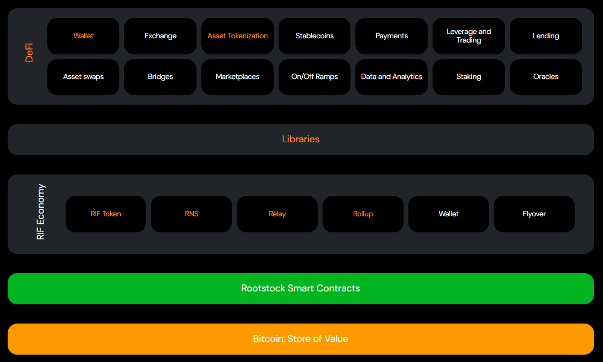
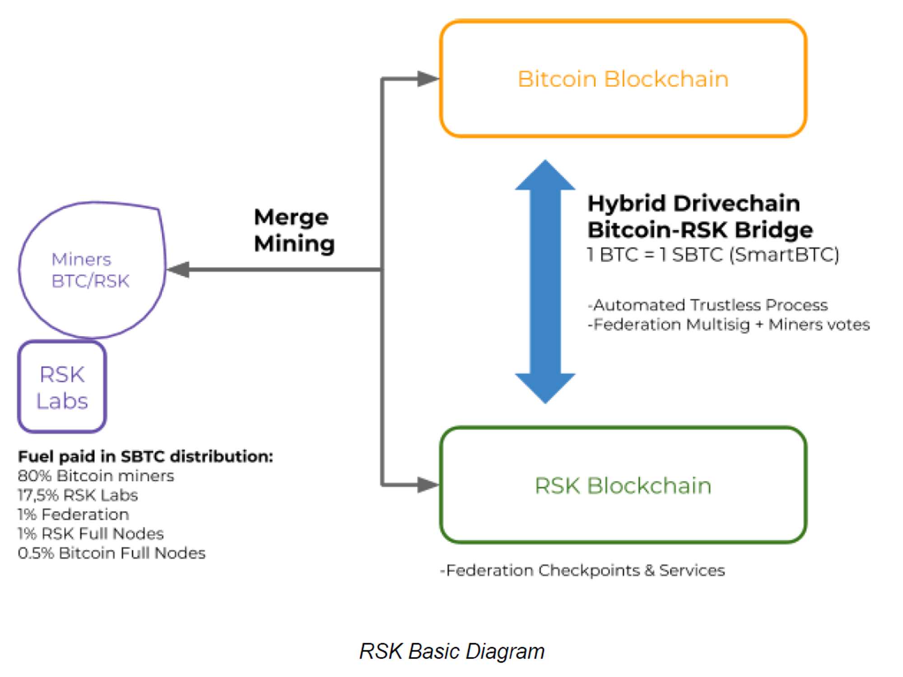

# **Rootstock: Leading the Charge in BTC Scalability**

## **Introduction**

This article is part of an ongoing series that explores the many different Bitcoin Scaling technologies available. In this edition, we will cover [**Rootstock (RSK)**](https://rootstock.io/), a protocol that extends Bitcoin’s capabilities through smart contracts, bringing new functionalities while enhancing scalability and maintaining robust security measures inherent to the Bitcoin network.

## **Overview**

Rootstock, also known as RSK, is the first open-source smart contract platform powered by the Bitcoin network. It aims to enrich the Bitcoin ecosystem by enabling smart contracts, near-instant payments, and improved scalability without compromising the network's inherent security. Launched in January 2018, RSK has progressed steadily and is currently fully operational, with continuous upgrades to further enhance its capabilities.

## **Protocol Quick Scan**

Rootstock operates by leveraging the security of Bitcoin through merged mining and a unique two-way peg, Powpeg, which connects Bitcoin to RSK. This system allows RSK to function with a high degree of decentralization and robust security without creating new coins; instead, it uses Bitcoin as its native currency. Key innovations introduced by RSK include its Ethereum Virtual Machine (EVM)-compatible Rootstock Virtual Machine (RVM), which allows Ethereum-based decentralized applications (DApps) to run on a Bitcoin-backed environment. The next significant upgrade (RVM2) aims to enhance VM performance by emulating EVM opcodes to a Java-like bytecode, promising performance close to native execution speeds.

📌 **Key Features:**

1. RVM compatibility with EVM for seamless execution of Ethereum DApps.
2. Merged mining with Bitcoin, enhancing network security without additional energy costs.
3. The upcoming RVM2 upgrade for substantial VM performance improvements.

## **Trust & Security**

RSK's security model is deeply intertwined with that of Bitcoin, relying on the same miners to secure both networks through merged mining. This method ensures that RSK inherits Bitcoin’s strong security properties without additional energy expenditure. The protocol’s trust elements are primarily centered around its two-way peg system, Powpeg, which uses a hybrid of cryptographic and hardware-based security measures to manage the conversion between Bitcoin and the native RSK token (RBTC). The security features include:

- Hardware Security Modules (HSMs) for managing private keys.
- Decentralized consensus through cumulative proof of work.
- Strong reliance on Bitcoin's hashing power for network security.

## **Additional Information**

**Virtual Machine:** The RVM is currently based on an interpreter model but plans to transition to a more advanced VM (RVM2) for better performance.
**Scalability:** RSK improves scalability through faster block times (approximately 30 seconds) compared to Bitcoin’s 10 minutes.
**Total Value Locked:** RSK has successfully secured a significant amount of Bitcoin through its two-way peg system, although specific figures fluctuate based on market conditions and user activity.

📌 **Additional Points:**

- RSK does not mint new coins but uses Bitcoin directly for transaction fees and smart contract interactions.
- Continuous upgrades and community proposals aim to enhance the protocol's decentralization and security features.

## **Pros and Cons**

**Pros:**

1. **Enhanced Functionality:** By enabling smart contracts, RSK adds substantial functionality to Bitcoin without altering its core properties.
2. **High Security:** Inherits Bitcoin’s robust security model through merged mining.
3. **Developer Friendly:** Supports Ethereum tools and DApps, significantly lowering the barrier for developers to build on Bitcoin.

**Cons:**

1. **Complexity:** The two-way peg system, while secure, adds complexity and might pose usability challenges.
2. **Still Centralized Elements:** Despite efforts towards decentralization, certain aspects like the management of the Powpeg still require trust in federated parties.
3. **Upgrade Dependency:** Many of RSK’s future improvements, including VM enhancements, are still in development, which may affect current performance and capabilities.

## **Protocol Details**

Rootstock’s technical backbone is its unique blend of Bitcoin’s security mechanisms with innovative contract execution layers. The protocol details include:

### **Merged Mining**

Rootstock (RSK) utilizes a consensus mechanism known as merged mining. This process allows RSK to be mined simultaneously with Bitcoin, meaning that Bitcoin miners can secure the RSK network without the need for additional computational power or energy expenditure. Merged mining works by having Bitcoin miners include a reference to the RSK block in their Bitcoin mining operations.

**How Merged Mining Works:**

1. **Mining Integration:** Bitcoin mining pools integrate RSK data into their mining process by including a reference to an RSK block in the jobs delivered to miners.
2. **Dual Mining:** When miners find a solution, it is validated against both Bitcoin and RSK network difficulties. If the solution meets the difficulty requirements of both networks, the RSK block is accepted alongside the Bitcoin block.
3. **Security and Efficiency:** This mechanism ensures that RSK benefits from the same level of security as Bitcoin because it shares the same group of miners and their combined hashing power. Importantly, this does not require miners to expend additional energy beyond what they are already using to mine Bitcoin.

**Benefits of Merged Mining:**

- **Enhanced Security:** By leveraging Bitcoin’s extensive mining network, RSK enjoys robust security against double-spending and 51% attacks.
- **No Extra Cost:** Miners do not incur additional costs as they mine two blockchains simultaneously.
- **Incentivization:** Miners earn transaction fees from the RSK network in addition to Bitcoin block rewards, providing extra incentive to participate in RSK mining.

### **Powpeg**

The Powpeg mechanism is a critical component of Rootstock’s security and functionality, enabling the two-way peg that allows bitcoins (BTC) to be converted into Rootstock's native tokens (RBTC) and vice versa. This system is designed to provide a high level of security and trust minimization, crucial for maintaining the decentralized ethos of blockchain technology.

**Mechanics of Powpeg:**

- **Secure Elements:** The Powpeg uses specialized hardware security modules (HSMs), which are tamper-proof devices that store and manage the cryptographic keys used in the pegging process. Each HSM runs a simplified version of the Rootstock node and participates in the network consensus.
- **Decentralized Control:** Powpeg functionaries, who are responsible for operating the HSMs, cannot unilaterally control the multi-signature addresses used in the pegging process. Instead, their role is limited to ensuring the continual online presence and proper functioning of their HSMs.
- **Cumulative Work Verification:** The HSMs only sign transactions that are validated by a significant amount of cumulative proof of work, ensuring that only transactions recognized by the most secure blockchain (with the most cumulative work) are processed.

**Security Features:**

- **Defense-in-Depth:** The Powpeg employs multiple layers of security, each designed to independently thwart different types of attacks.
- **Coordination Transparency:** All communications among the functionaries are conducted publicly on the Rootstock blockchain, ensuring transparency and reducing the risk of collusion.
- **Firmware Attestation:** The firmware running on the HSMs is verified through a deterministic build process, enhancing trust in the integrity of the devices.

### **Rootstock’s Virtual Machine (RVM)**

Rootstock's Virtual Machine (RVM) is an Ethereum Virtual Machine (EVM)-compatible execution environment that allows developers to deploy smart contracts and DApps using the same tools and languages prevalent in the Ethereum ecosystem. This compatibility is strategically important as it facilitates the migration of existing DApps from Ethereum to Rootstock, leveraging Bitcoin’s security.

**Key Features:**

- **EVM Compatibility:** The RVM is fully compatible with the EVM at the opcode level, meaning that most smart contracts written for Ethereum can run on Rootstock without any modifications.
- **Execution Environment:** Contracts on RVM are executed by all full nodes across the network, ensuring that the state of the blockchain is maintained consistently across all participants.
- **Future Upgrades:** Plans for the RVM include transitioning from an interpreted execution model to a Just-In-Time (JIT) compiled model. This upgrade, tentatively called RVM2, aims to significantly improve the performance by dynamically retargeting EVM opcodes to a subset of Java-like bytecode. This shift is expected to bring execution speeds close to that of native processing, reducing transaction processing times and improving overall network throughput.

**Advantages of RVM:**

- **Security:** By inheriting Bitcoin’s security model through merged mining, the RVM provides a secure platform for executing smart contracts.
- **Developer Accessibility:** Developers can use familiar tools such as Truffle and Remix, along with Solidity programming language, to create and deploy smart contracts on Rootstock.
- **Innovative Upgrade Path:** The proposed upgrades to RVM promise to keep it at the cutting edge of blockchain technology, potentially increasing its adoption and utility in the blockchain ecosystem.

## **References**

- Rootstock Documentation: https://dev.rootstock.io/
- Rootstock Whitepaper: https://rootstock.io/rif-whitepaper-en.pdf