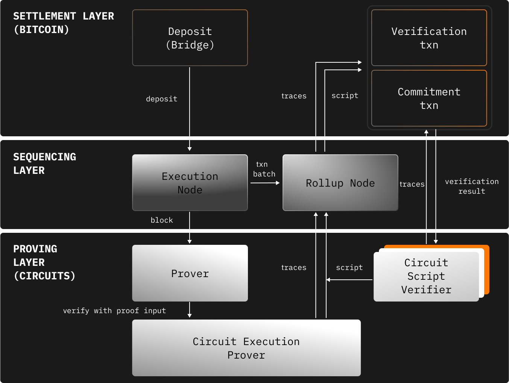
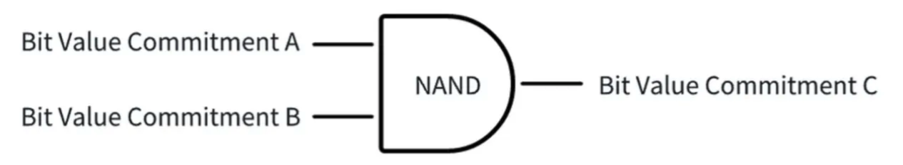
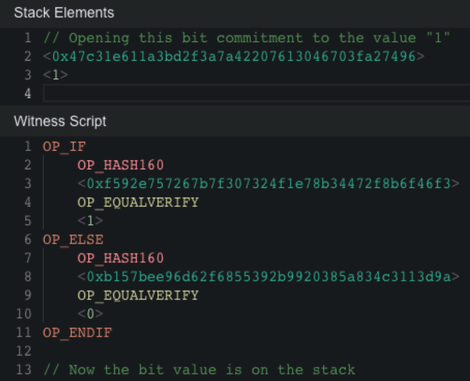
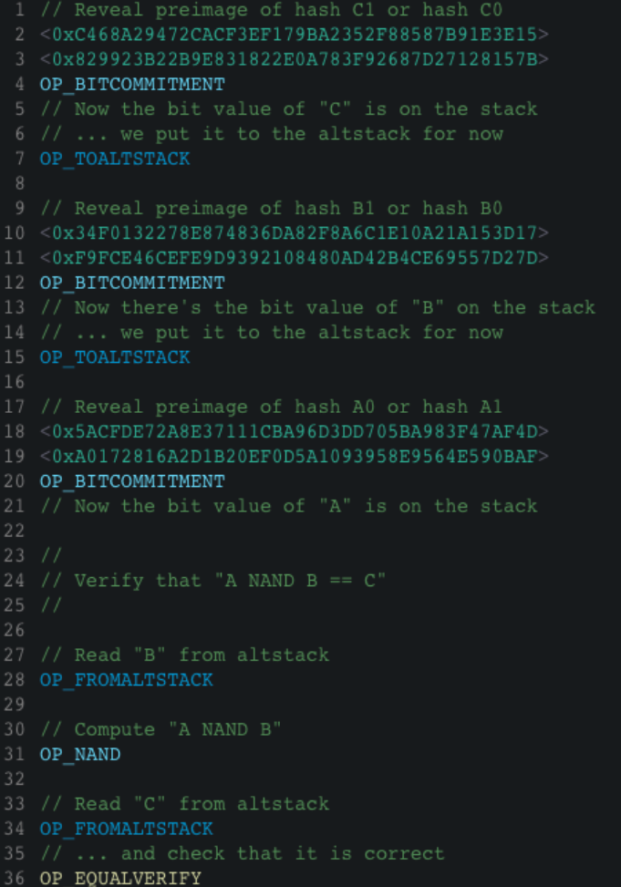
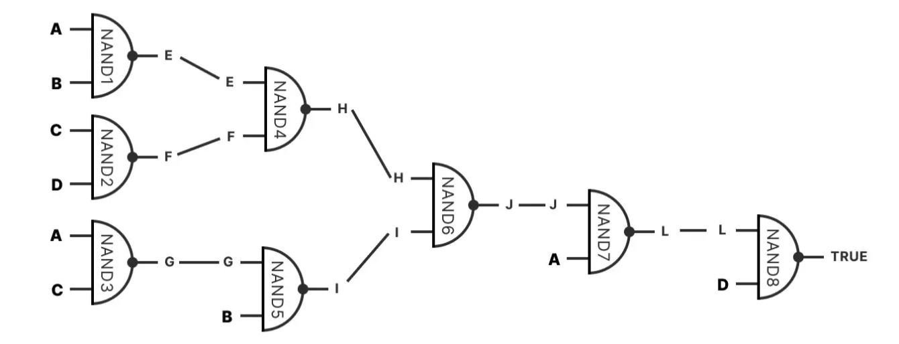
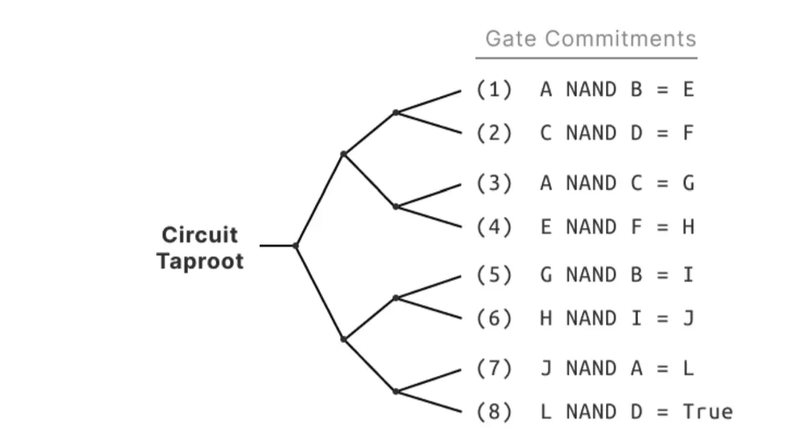
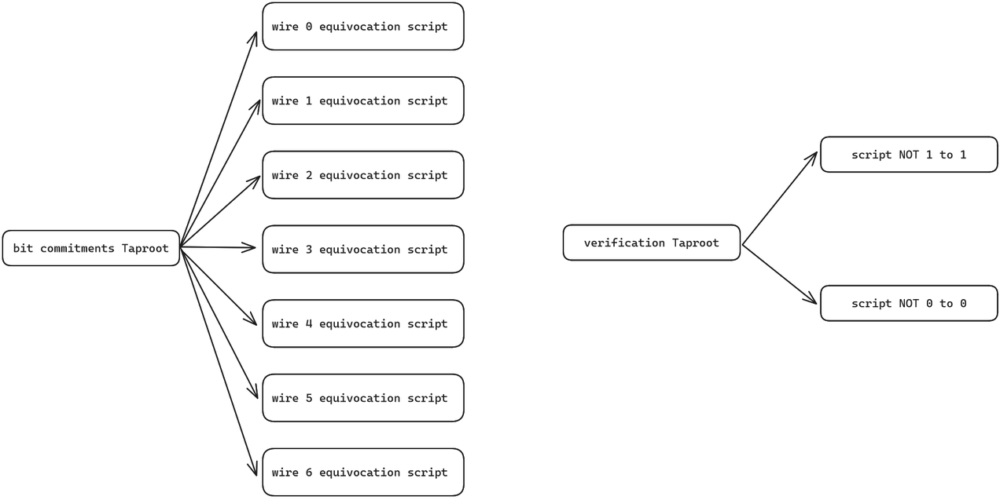
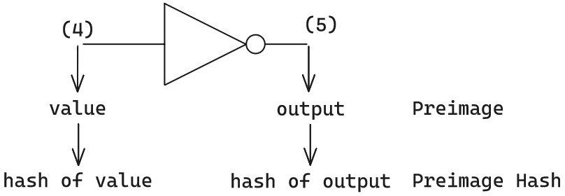

# SatashiVM

## Introduction
The main focus of this article is to introduce the basic overview of SatoshiVM, along with its technical architecture and operational principles.

## Overview
SatoshiVM is a decentralized Bitcoin ZK Rollup Layer 2 solution compatible with the Ethereum Virtual Machine (EVM) ecosystem, using native BTC as gas. Thanks to its compatibility with the EVM, SatoshiVM empowers Bitcoin with the ability to utilize EVM features, enabling asset issuance and application development supported by EVM. This opens up many possibilities for the evolution of the ecosystem.
## Protocol Quick Scan

### Features
SatoshiVM possesses the following technological features:
1. ZK EVM: SatoshiVM is a versatile ZK Rollup that employs EVM for off-chain computations. This implies that users can interact with SatoshiVM in a manner similar to interacting with Ethereum, and developers can build on top of SatoshiVM just as they would on Ethereum.
2. ZK Rollup: SatoshiVM utilizes Rollup technology to bundle multiple transactions into a single batch and validate them on the Bitcoin main network as a single transaction. This ensures the same level of security as the Bitcoin main network, guaranteeing data validity and availability.
3. ZK Fraud Proofs: SatoshiVM utilizes technologies such as Taproot and Bitcoin Script to perform on-chain verification of contracts without altering the consensus rules of the Bitcoin network, thereby accomplishing the computation of fraud proofs.
4. Data Availability: SatoshiVM must release transaction data on the Bitcoin main network, enabling anyone to verify the correctness of computations executed off the Bitcoin main network.
5. BTC Native Gas: SatoshiVM employs native BTC as gas for the EVM. Similar to ETH OP Rollup / ZK Rollup Layer 2 solutions that use ETH as gas for Layer 2, SatoshiVM utilizes BTC as the gas for EVM transactions

### Architecture

SatoshiVM chain consists of three layers:

**Settlement Layer (Bitcoin Network)**
- Bitcoin serves as the settlement layer, bridging and deploying Rollup scripts on the Bitcoin network.
- Provides data availability, ordering, and validation proofs.
- Allows users and dApps to send messages and assets between Bitcoin and SatoshiVM.

**Ordering Layer**
- Includes execution nodes and Rollup nodes.
- Execution nodes are responsible for
  - executing transactions submitted by users to the SatoshiVM sequencer and L1 bridging scripts, then generating L2 blocks.
- Rollup nodes are responsible for
  - processing batch transactions, publishing transaction data and block information to the Bitcoin network to ensure data availability.
  - periodically submitting state commitments (L2 state root) to the Bitcoin chain, representing the completion of bulk off-chain transaction execution and reaching a new state.
  - submitting ZK validity proofs related to commitments for finality verification, published in the form of Taproot UTXOs on the BTC mainnet.

**Proof Layer**
- Includes a coordinator, proof pool, and validators.
- The coordinator assigns proof tasks to the proof pool and passes the generated proofs to Rollup nodes.
- The proof pool is responsible for generating validity proofs to verify the correctness of L2 transactions, then passing them back to the coordinator.
  - Validators generate two commitments related to validity proofs (referring to the BitVM scheme)
    - Used to verify the commitment of the published Preimage Commitment script (corresponding to the bit commitments Taproot UTXO published by Rollup nodes to the BTC mainnet).
    - Used to verify the commitment of the disclosed execution trace script's correctness (corresponding to the verification Taproot UTXO published by Rollup nodes to the BTC mainnet).

## Trust & Security

SatoshiVM utilizes ZK Rollup technology to bundle multiple transactions into a single batch and validate them as a single transaction on the Bitcoin mainnet. This ensures the same level of security, data validity, and availability as the Bitcoin main network.

SatoshiVM's Sequencer utilizes a private memory pool, ensuring that transaction data in the transaction pool is not publicly disclosed. Not disclosing transaction data in the transaction pool can lead to a lack of transparency, fairness, and auditability, increasing the risks of censorship, fraud, and system uncertainty. SatoshiVM mitigates this issue through the following schemes:
- ZK Rollup also employs zero-knowledge proofs to verify the correctness of off-chain computations without revealing details.
- SatoshiVM supports users directly sending corresponding formatted transactions to L1 to achieve censorship resistance.

SatoshiVM's Sequencer is centralized, hence it is susceptible to single point of failure issues.

### Rollup Node Availability
To ensure Rollup nodes synchronize transaction data and generate state commitments, SatoshiVM has designed two primary methods to ensure node availability:

1. **Establishing P2P Networks between Rollup Nodes:** Rollup nodes establish peer-to-peer networks, allowing them to request and synchronize the latest transaction batches from the Sequencer, enhancing data availability.

2. **Direct Retrieval from the Bitcoin Chain:** In case of isolation from the Sequencer or other nodes, Rollup nodes can directly retrieve transaction data periodically published by the Sequencer on the Bitcoin chain, bypassing isolation to restore synchronization capabilities.

As a specialized role within Rollup nodes, the Proposer, after completing data synchronization, executes transaction batch calculations and generates new state commitments. Ultimately, the Proposer uploads this commitment data to the Bitcoin chain, ensuring the final results of off-chain computations are publicly verifiable on-chain. Through this design, even in extreme isolation scenarios, Rollup nodes and Proposers maintain basic data availability and state commitment submission capabilities.

### Fund Security
SatoshiVM employs the DHC custody scheme for asset custody. While the DHC custody architecture leverages advanced cryptographic technologies such as ZKP, MPC, and TEE, it still faces multiple potential risk challenges, including key mismanagement, single point of failure, protocol vulnerabilities, and system scalability.
<!-- 
### 私有内存池
SatoshiVM的Sequencer使用私有内存池，SatoshiVM不会公开交易池中的交易数据。不公开交易池中的交易数据会导致缺乏透明度、公平性和可审计性,增加了审查、欺诈和系统不确定性的风险。但通过 ZK证明的方式 和 发送交易到 L1 的方式 大大降低了这些风险。 -->

<!-- 
不公开交易池中的交易数据会带来一些潜在的问题和风险:
- 审查和审查阻碍： 由于交易池是私有的,Sequencer可以选择性地包括或排除某些交易,导致审查和审查阻碍的风险。用户无法验证自己的交易是否被公平对待和及时处理。
- 缺乏公开可审计性：公开的交易池可以让所有人查看等待处理的交易,提高了系统运行的透明度和可审计性。私有交易池则缺乏这种公开透明性,可能增加人们对系统的不信任感。
- 缺乏资源优先级管理：在公开交易池中,用户可以通过支付更高的手续费来获得更高的优先级。但在私有交易池中,Sequencer可以任意决定优先顺序,没有经济激励机制约束。
- 交易顺序可预测性差：由于看不到等待处理的交易,难以预测自己交易的处理顺序。这可能导致一些应用程序(如机器人交易等)缺乏确定性。
- 无法检查交易是否丢失：用户无法验证自己提交的交易是否被接收到交易池中,也无法检测交易是否遗漏处理。这给系统的可靠性带来一定隐患。

总的来说,不公开交易池会增加系统的不透明性,降低公众监督和可审计性,给用户的公平性和系统的安全性带来一定风险。开放透明的交易池虽然会增加一些运营成本,但有利于提高系统的公信力。 -->

## Protocol Details

The core of SatoshiVM lies in the verification of Rollup transactions, which is built upon the BitVM verification solution and further enhanced with some improvements.

### BitVM
BitVM was proposed by Robin Linus, a core contributor to ZeroSync, and was released in a [whitepaper](https://bitvm.org/bitvm.pdf) on October 9, 2023.

#### BitVM Circuit

In Arbitrum's interactive fraud-proof protocol, disputing parties engage in multiple rounds of communication to continually refine specific transaction instructions until they pinpoint the disputed opcode. Subsequently, this opcode along with its inputs and outputs are executed directly on the Ethereum blockchain for verification. This process determines which party's claim is correct and penalizes the malicious party.

In the BitVM scheme, due to the simplicity of Bitcoin scripts, it is not feasible to directly verify EVM opcodes as in Ethereum Layer 2 solutions. Therefore, an alternative approach is adopted: opcodes compiled from any high-level language are decoded back into the form of logical gate circuits. Then, Bitcoin Script is used to simulate the operations of these logical gate circuits. This allows for an indirect simulation of the effects of virtual machine opcodes (such as EVM opcodes) on the Bitcoin blockchain.

From the perspective of compiler theory, understanding the BitVM scheme involves translating `EVM/WASM/Javascript` opcodes into Bitcoin Script opcodes, with logical gate circuits serving as an intermediate representation (IR) between "EVM opcodes -> Bitcoin Script opcodes".

#### Proofs and Challenges

##### Bit Value Commitment

The bit value commitment is the most elementary component of the system. It allows the prover to set the value of a particular bit to either “0” or “1”. Especially, it allows the prover to set the value of a variable across different Scripts and UTXOs. This is key, as it extends the execution runtime of Bitcoin’s VM by splitting it across multiple transactions.

A bit value commitment consists of two hash values, hash0 and hash1. At a later point in time, a prover sets the value of a bit to "0" by revealing preimage0 (the preimage of hash0), or to "1" by revealing preimage1 (the preimage of hash1).

Each line of a logical gate can have independent bit commitments. For example, hash(0xa0) can represent the 0-value commitment for line A, hash(0xa1) can represent the 1-value commitment for line A; hash(0xb0) can represent the 0-value commitment for line B, and hash(0xb1) can represent the 1-value commitment for line B.

> Simply put, a bit value commitment is representing the value 0 or 1 with a random number, which serves as the commitment. It's important to note that each input and output of a gate may have different bit commitments.

The script is represented as follows:

##### Logic Gate Commitment

Any computable function can be represented as a Boolean circuit. The NAND gate is a universal logic gate, so any Boolean function can be composed from them. It contains two bit commitments representing the two inputs and a third bit commitment representing the output. The Script computes the NAND value of the two inputs to ensure that it matches the committed output bit.

##### Binary Circuit Commitment

BitVM Merkleizes the commitments of logical gates, and then refers to the Merkel Root as the Binary Circuit Commitment.

If there is a binary circuit as follows:

The binary circuit commitment is the Merkel Root created based on each logical gate.

#### Challenges and Responses

BitVM publishes the root of the bit value commitment tree as the Bit Commitments Taproot UTXO, and publishes the binary circuit commitment as the Binary Circuit Commitment Taproot UTXO.

<!-- 挑战者在要求证明者出示证明时，证明者只需要出示 数据片段 + Merkle Proof /Branch 即可。这种可以极大程度压缩 上链 的数据量，且能保证 上链 数据真的存在于MAST树上。而且，仅在BTC链上公开小部分数据片段+Merkle Proof，而不是公开所有数据，能起到很好的隐私保护效果。 -->

When a dispute arises, the challenger declares on the BTC chain which Binary Circuit Commitment Taproot issued by the prover they are challenging, and then requests the prover to reveal a specific segment of data corresponding to the Root. Subsequently, the prover presents a Merkle proof, repeatedly disclosing small portions of the Merkle tree on-chain through a binary search until both the challenger and the prover jointly identify the disputed logical gate circuit.

### SataoshiVM Circuit
SatoshiVM is based on the BitVM scheme. SatoshiVM adopts the Bristol format to express its logical gate circuit structure.

The Binary Circuit Commitment Taproot in BitVM is referred to as the Verification taproot in SatoshiVM.

### SatoshiVM Proof Challenge
The proof challenge method of SatoshiVM differs from BitVM. SatoshiVM significantly simplifies the process of "multi-round interaction to identify which small piece of data is problematic," requiring only one round of interaction to complete the verification process. In BitVM and any similar systems, this process could last for several hours.

SatoshiVM adopts a non-interactive on-chain verification approach. Once a proposer submits a commitment on the BTC chain, validator nodes on the Bitcoin chain observe this commitment value and attempt to obtain the complete original dataset corresponding to this commitment off-chain to verify its integrity. If an error is detected, validators can initiate a one-time interaction, directly communicate with Bitcoin nodes, and identify specific errors in the original dataset associated with the commitment submitted by the proposer. Subsequently, validators can transfer the proposer's Bitcoin UTXO as a penalty.
<!-- 一次性交互的方式使得挑战过程省时，上链数据更小从而节约 gas 成本。 -->

### Asset Bridging

#### Deposit

On the alpha mainnet, assets are securely deposited through Dynamic Hiding Committee (DHC) custody. DHC securely holds Bitcoin assets based on ZKP, MPC, and TEE technologies. The custody method on the mainnet is not specifically specified.

#### Withdrawal

Withdrawal transactions involve the following three steps:
- Users initiate Layer 2 transactions, declaring withdrawals and specifying the amount to be withdrawn.
- After the Layer 2 block containing the withdrawal transaction is finally confirmed, users submit withdrawal proofs on Layer 1, requesting to withdraw an equivalent amount of assets from the public account.
- Wait for the withdrawal challenge period to end (which may take several hours).

<!-- ## 疑问
1. 前像承诺
前像承诺中给出的例子如下，文中说到通过 “hash of value” 和 "hash of output" 就可以隐藏原值，但是对于门电路，输入输出只有 0 跟 1 两种值，所以不能达到隐藏原值的效果。这里想要表达的应该是 BitVM 中提到的 Bit commitment 中的 preimage

1.  -->

## Pros and Cons

### Pros
Compared to RGB++ and BEVM, SatoshiVM implements a verifiable Layer 2 with non-interactive verification during the verification phase, resulting in shorter verification times compared to BitVM.

<!-- > Difficulty of implementation? Is it more secure? -->

### Cons (or Challenges)

#### Data Availability Layer (DA Layer)
The [official documentation](https://docs.satoshivm.io/satoshivm/layer2-overview/architecture/mainnet) states that the mainnet will use the BTC chain as the DA layer, which has no precedent in Ethereum L2 solutions. Using the BTC chain as the DA layer will limit the TPS of L2 to the data capacity of L1 and may incur expensive GAS costs, which may not have been clearly articulated by the official source.

- The availability of Rollup nodes depends on obtaining transaction data from the BTC network.

#### Centralized Sequencer

The Sequencer of SatoshiVM is centralized, leading to risks such as node attacks, single point of failure, trust costs, and centralization risks.

## References
- [SatoshiVM white paper](https://github.com/SatoshiVM/whitepaper)
- [SatoshiVM yellow paper](https://github.com/SatoshiVM/yellowpaper)
- [SatoshiVM official document](https://docs.satoshivm.io/satoshivm/layer2-overview/asset-bridge)
- [BitVM white paper](https://bitvm.org/bitvm.pdf)