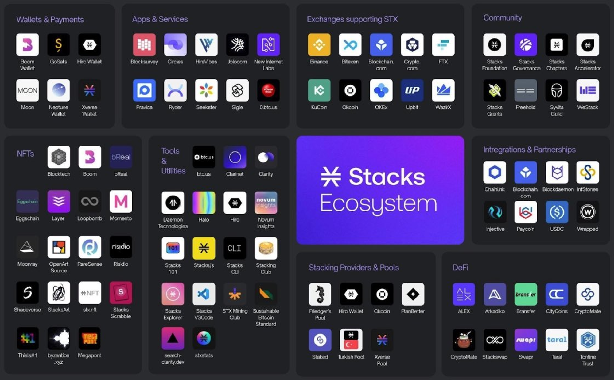
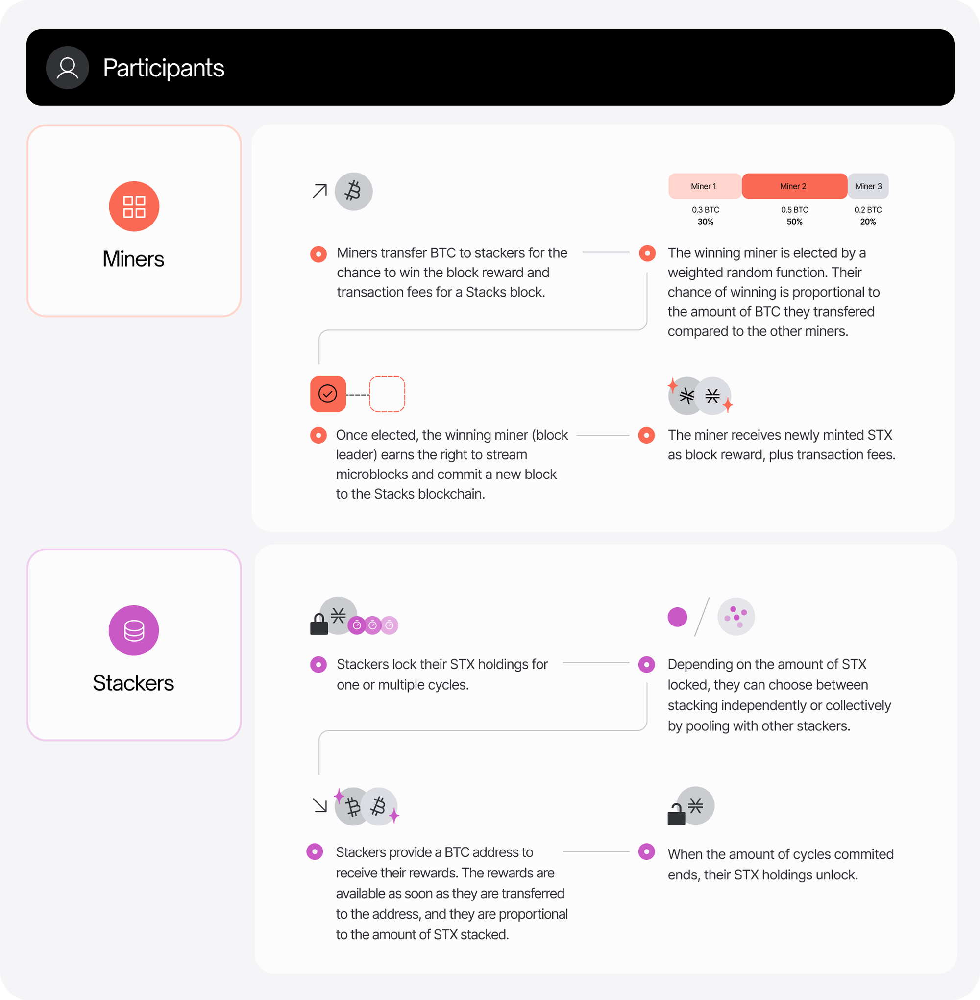
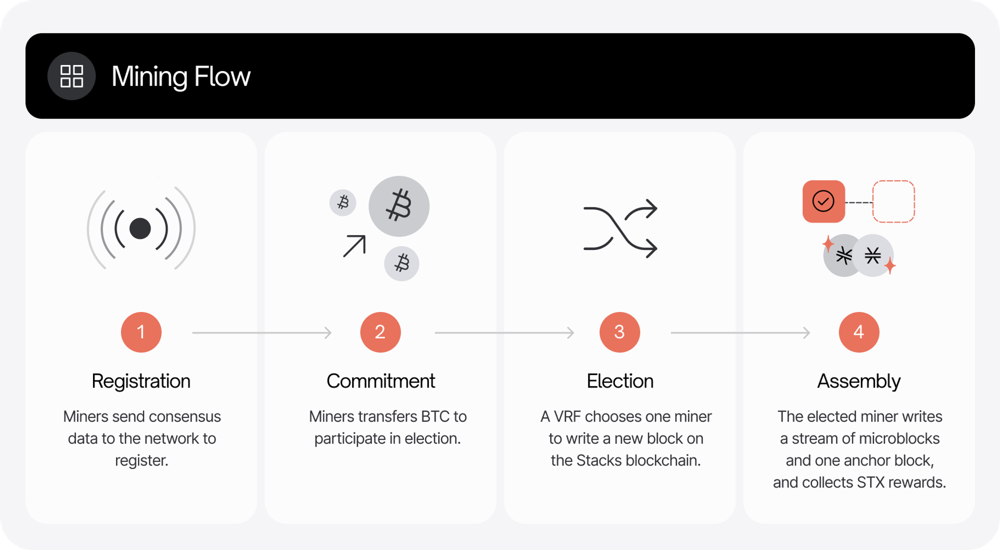
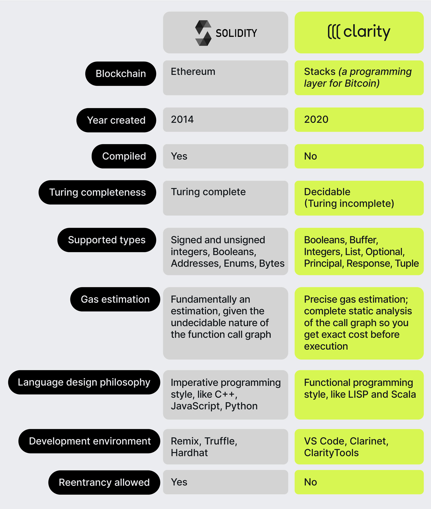

# Stacks: An Exploration of Bitcoin's Layer 2 Smart Contract Infrastructure

## **Introduction**

This series of articles delves into various Bitcoin Scaling Solutions, providing a comprehensive analysis of their design, functionality, security features, and more. Our aim is to offer insights that help developers, investors, and enthusiasts understand the complex landscape of this technology. In this article, we explore Stacks, a unique protocol that extends Bitcoin's functionality.

## **Overview**

Stacks is a protocol that introduces smart contracts and decentralized applications (DApps) to Bitcoin without altering its protocol. It operates as a layer-2 solution on Bitcoin, leveraging Bitcoin's security and combining it with scripting capabilities.

Stacks addresses the limited functionality of Bitcoin, which does not natively support complex smart contracts or DApps. It aims to unlock Bitcoin's potential as a programmable base layer, enhancing its utility beyond just a digital currency.

Stacks was initially released in early 2021, with significant updates planned, such as the Nakamoto release. This protocol continues to evolve, aiming to deepen its integration with Bitcoin and expand its feature set.

## **Protocol Quick Scan**

Stacks is fundamentally designed to extend Bitcoin's utility by enabling smart contracts and decentralized applications (DApps) without altering the core Bitcoin protocol. This is achieved through the Proof of Transfer (PoX) consensus mechanism, which directly links the Stacks blockchain with Bitcoin's blockchain. The innovative aspect of PoX lies in its method of not just burning the cryptocurrency used in proof-of-burn (PoB) systems but transferring it to support consensus and smart contract execution. This transfer rewards participants in the network, aligning incentives and securing the network.

Every Stacks block is tethered to a Bitcoin transaction; a hash of the Stacks block is recorded in a Bitcoin block, leveraging the security and immutability of Bitcoin. This linkage ensures that any action on the Stacks blockchain can inherit Bitcoin’s robust proof-of-work security model. The system also integrates a mechanism where miners on the Stacks blockchain bid for the right to publish a block by transferring Bitcoin to holders who are participating in the network by locking their Stacks tokens (STX) to earn rewards.

The Stacks blockchain distinguishes itself from other Bitcoin Scaling Solutions with some key differentiators:

- **Clarity Smart Contract Language**: Stacks introduces Clarity, a decidable, not Turing complete, smart contract language. An example of the importance of decidability in the context of smart contracts, is that it is not possible for a Clarity call to run out of gas in the middle of a call. Also, because of its decidability, it is possible to get a complete static analysis of the call graph to get an accurate picture of the cost before execution. Clarity is designed to avoid common pitfalls in smart contract programming such as reentrancy attacks and unpredictable gas fees, which are prevalent in other blockchain ecosystems.
- **Direct Reward Mechanism**: Through the PoX mechanism, Stacks does not burn the base cryptocurrency (Bitcoin, in this case) to achieve consensus. Instead, it uses these assets to reward participants, thus creating a direct economic linkage between Stacks' operation and Bitcoin's security model. This is a novel approach in blockchain architectures, which typically either use new tokens for rewards.

Stacks introduces several technical innovations:

- **Proof of Transfer (PoX)**: As mentioned, this is a variation of proof-of-burn but designed to recycle the energy and economic expenditure of Bitcoin’s proof-of-work by transferring BTC to support network consensus and smart contract execution on Stacks. This not only secures the network but also aligns the incentives across Bitcoin and Stacks.
- **Native Integration of Bitcoin Security**: The operations on Stacks are settled on the Bitcoin blockchain, meaning any operation that modifies the state of the Stacks blockchain (like transactions or smart contract executions) will ultimately be confirmed on Bitcoin.
- **Microblocks and Anchor Blocks**: Stacks employs a new approach to block generation that includes both microblocks and anchor blocks. Microblocks allow for near-instant transaction processing, enhancing the user experience by providing rapid feedback on actions taken on the blockchain. Anchor blocks are produced periodically and include a hash reference to all the preceding microblocks, anchoring them indelibly into the history secured by Bitcoin’s blockchain.

## **Trust & Security**

Stacks’ architecture requires users to place trust in several key components:

- **Proof of Transfer (PoX)**: The cornerstone of Stacks' connection to Bitcoin, PoX requires users to trust that the incentive mechanisms and the transfer of Bitcoin to support network functions are executed correctly and securely.
- **Clarity Smart Contracts**: Given that these contracts are executed exactly as written and are visible on the blockchain, users must trust in the clarity and correctness of the code they interact with.
- **Consensus Participants**: While Stacks leverages Bitcoin’s security, it also depends on its own network of miners and Stacking participants (those who lock STX to support network consensus and earn rewards). Unlike Ethereum L2s, withdrawing BTC from Stacks requires signatures from peg-out signers. To fulfill an sBTC withdrawal request, Stackers need to send Bitcoin transactions that pay the requested amount of BTC to the withdrawal address stipulated by the withdrawal request. This means the network’s security is partly contingent upon their honest participation.

## **Additional Information**

### **Virtual Machine**

Stacks uses the Clarity virtual machine for smart contracts. Clarity is not Turing-complete, which means all outcomes of a program are predictable before it runs. This ensures security but differs from more common, flexible virtual machines.

### **Scalability**

While Stacks does not compete with high-throughput blockchains like Solana or Ethereum in terms of raw transactions per second, it is designed to scale smart contract execution in a manner that leverages Bitcoin’s security without overloading it. The use of microblocks allows for rapid transaction processing within the constraints of Bitcoin’s block time.

Stacks aims to process transactions faster than Bitcoin, by introducing Fast Blocks in the [Nakamoto Release](https://docs.stacks.co/nakamoto-upgrade/nakamoto-in-10-minutes). Historically, because Stacks blocks have been anchored 1:1 to Bitcoin blocks, slow block times and transaction times have been one of the biggest pain points for Stacks users and developers. Nakamoto brings significantly faster block times by decoupling Stacks block production from Bitcoin block production. In Nakamoto, new Stacks blocks are produced roughly every 5 seconds. 

### **Total Value Locked (TVL)**

The Total Value Locked (TVL) in Stacks indicates how much Bitcoin is used in its ecosystem for smart contracts and applications.The TVL in Stacks is approximately [$255M](https://defillama.com/chain/Stacks), showing the amount of assets engaged in the Stacks network.

### **Pros and Cons**

**Pros**

- **Enhanced Bitcoin Utility**: Stacks makes Bitcoin programmable, extending its utility beyond just a store of value without compromising its core attributes.
- **Innovative Smart Contract Language**: Offers Clarity, which is designed to reduce common smart contract risks.
- **Economic Alignment**: PoX aligns the economic incentives of Bitcoin holders and Stacks users, fostering a unique ecosystem synergy.

**Cons**

- **Limited Throughput**: The reliance on Bitcoin’s block times and structure inherently limits transaction throughput compared to other blockchains designed for higher performance.

## **Protocol Details**

For those interested in learning more about Stacks, this section dives deeper into the technical intricacies and novel architectural decisions underpinning the Stacks protocol, particularly focusing on its Proof of Transfer (PoX) consensus mechanism, Clarity smart contract language, and its operational relationship with Bitcoin's blockchain. 

### Integration with Bitcoin

Stacks' integration with Bitcoin through the Clarity smart contract language is fundamental to its architecture, enhancing Bitcoin's functionality with advanced smart contract capabilities. This setup allows Stacks to utilize Bitcoin's security strengths while enabling more complex operations typical of decentralized applications.

**Reading from the Bitcoin Blockchain**

Clarity can directly access the state of the Bitcoin blockchain through the **`get-burn-block-info?`** function, which retrieves the header hash of a specified Bitcoin block. This function enables Clarity contracts to respond dynamically to events occurring on the Bitcoin network by using the **`burn-block-height`** keyword to determine the current Bitcoin block height. However, it's important to note that this function only pulls data from Bitcoin blocks that have been confirmed after the Stacks chain was launched, meaning Clarity can only react to Bitcoin events with a slight delay.

**Writing to the Bitcoin Blockchain**

Writing back to the Bitcoin blockchain from Clarity is more complex. Currently, Stacks uses a layered approach where this interactions are powered by the Proof of Transfer (PoX) mechanism, ensuring operations initiated on Stacks are also confirmed in the bitcoin blockchain.

### **Clarity Smart Contract Language**

Clarity represents a departure from the norm in blockchain programming languages, opting for a decidable language that is not Turing-complete. This decision allows developers to know, with certainty, what a program will do before executing it on the blockchain. The language is interpreted rather than compiled, which means the code is executed exactly as written without any intermediary bytecode, reducing potential security risks from compiler flaws.

**Key Features**:

- **Predictability**: Each contract’s outcome can be known before it is executed, which is critical for financial services and other high-stakes applications on the blockchain.
- **No Gas Estimations**: Unlike Ethereum’s gas model, Clarity requires that the costs of transactions are calculated upfront, eliminating the risk of out-of-gas errors mid-execution.
- **Direct Access to Bitcoin State**: Clarity contracts can query the state of the Bitcoin blockchain, allowing the contracts to trigger actions based on Bitcoin transactions. This is pivotal for applications that need to interact cross-chain.

**Security Aspects**:
Clarity is designed with security as a primary concern, incorporating features that address common vulnerabilities in other smart contract languages. For instance, the language structure inherently prevents reentrancy attacks—a common issue in Ethereum contracts.

### **Nakamoto Release**

The Nakamoto Release represents a significant upgrade in the Stacks network, planned as a hard fork to introduce several pivotal enhancements.

**Current Design and Identified Problems**:

- The existing design, governed by SIP-001, SIP-007, and SIP-015, relies heavily on a sortition process for miner selection, which ties the block production rate to Bitcoin’s slower block time. This has led to high transaction confirmation latency and other inefficiencies such as ineffective microblocks and potential for cheaper reorganizations of the Stacks chain.

**Proposed Solutions**:

- **Fast Blocks**: By allowing miners to produce multiple blocks between Bitcoin’s block intervals, the Nakamoto Release aims to drastically reduce transaction confirmation times, moving from a scale of minutes to seconds.
- **Robust Chain Reorganizations**: With the introduction of mechanisms that require a significant majority for forks and tie reorganizations to Bitcoin’s blockchain, the Stacks network aims to significantly enhance its security and stability.
- **Miner Extractable Value (MEV) Resistance and Fair Play**: Modifications in the sortition process aim to curb the advantages that could potentially be exploited by Bitcoin miners or Stacks miners who might influence the network’s fairness and security.

The Nakamoto Release is designed to address the scalability and security challenges faced by the Stacks network while enhancing its integration with Bitcoin. By implementing these changes, Stacks not only aims to improve its operational efficiency but also solidifies its position as a pioneering layer enabling smart contracts and applications directly on Bitcoin. 

### **References**

- Stacks Whitepapers: https://docs.stacks.co/stacks-101/whitepapers
- Official Stacks Documentation and Developer Guides: https://docs.stacks.co/
