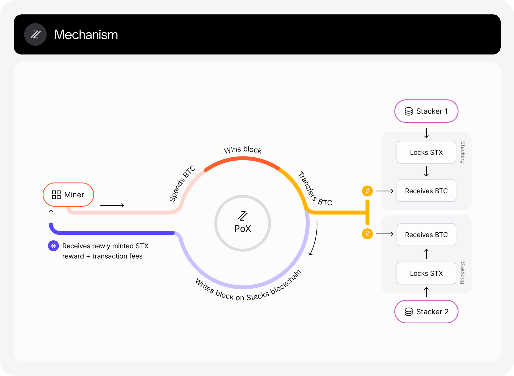

# 探索比特币二层智能合约基础设施的Stacks

## 引言

这篇文章深入探讨了各种比特币扩展解决方案，全面分析了它们的设计、功能、安全特性等。我们的目标是提供帮助开发者、投资者和爱好者理解这项技术复杂格局的洞见。在本文中，我们探讨了Stacks，这是一个扩展比特币功能的独有协议。

## 概览

Stacks是一个协议，它在不改变比特币协议的情况下，为比特币引入了智能合约和去中心化应用（DApps）。它作为比特币的二层解决方案运行，利用比特币的安全性并结合了高级脚本功能。

Stacks解决了比特币功能有限的问题，比特币原生不支持复杂的智能合约或DApps。它的目的是释放比特币作为可编程基础层的潜力，增强其作为数字货币之外的实用性。

Stacks最初于2021年初发布，并仍在计划进行重大更新，例如Nakamoto Release。这个协议不断发展，旨在深化其与比特币的集成并扩展其功能集。

## 协议速览

Stacks协议的核心设计宗旨是在不改变比特币核心协议的前提下，通过启用智能合约和去中心化应用（DApps），扩展比特币的实用性。这一目标的实现依托于转移证明（Proof of Transfer, PoX）共识机制，该机制直接将Stacks区块链与比特币区块链相连。

PoX的创新之处在于，它采用了一种不同于传统燃烧证明（Proof of Burn, PoB）系统的方法，通过转移比特币来支持网络共识和智能合约的执行，从而奖励网络参与者。这种转移不仅增强了网络的安全性，还对齐了比特币和Stacks之间的激励机制。

每个Stacks区块都与比特币交易紧密关联；Stacks区块的哈希值会被记录在比特币区块中，借助比特币的安全性和不可篡改性。这种连接确保了Stacks区块链上的任何操作都能继承比特币PoW共识所确保的安全性。此外，系统还整合了一种机制，Stacks区块链上的矿工通过将比特币转移到参与网络并锁定其Stacks代币（STX）以获得奖励的持有者手中，竞标发布区块的权利。

Stacks区块链与其他比特币扩展解决方案的最主要区别包括：

- **Clarity智能合约语言**：Stacks引入了Clarity，这是一种可判定的、非图灵完备的智能合约语言。可判定性是Clarity的一个重要特性，意味着在实际将任何给定的智能合约部署到区块链之前，就能知道其执行结果。这对于需要在所有情况下保证其应用程序行为的开发者和企业至关重要。Clarity旨在避免智能合约编程中的常见陷阱，如重入攻击和不可预测的燃气费用，这些在其他区块链生态系统中非常普遍。

- **直接奖励机制**：通过PoX机制，Stacks不燃烧基础加密货币（本例中为比特币）来达成共识。相反，它使用这些资产来奖励参与者，从而在Stacks的运作和比特币的安全模型之间建立了直接的经济联系。这是区块链架构中的一种新颖方法，通常要么使用新代币作为奖励。

Stacks还引入了几项技术创新：

- **转移证明（PoX）**：如上所述，这是一种燃烧证明的变体，旨在通过转移BTC来支持Stacks上的网络共识和智能合约执行，从而回收比特币的工作量证明所消耗的能源和经济开支。这不仅保护了网络，还对齐了比特币和Stacks之间的激励。

- **比特币安全性的集成**：Stacks上的操作会锚定在比特币上，这意味着任何修改Stacks区块链状态的操作（如交易或智能合约执行）最终都将在比特币上得到确认。这利用了比特币无与伦比的网络安全性，为更复杂的操作提供了一个安全的次级层。

- **微块和锚块**：Stacks采用了一种新的区块生成方法，包括微块和锚块。微块允许近乎即时的交易处理，通过为区块链上采取的行动提供快速反馈，增强了用户体验。锚块会定期产生，并包含对所有先前微块的哈希引用，将它们永久地锚定在由比特币区块链保护的历史中。

## **信任与安全**

Stacks架构的设计要求用户对几个关键组成部分持有信任：

- **转移证明（PoX）**：作为Stacks与比特币连接的基石，PoX依赖于用户对于激励机制以及比特币转移以支持网络功能能够被正确且安全执行的信任。

- **Clarity智能合约**：鉴于这些合约的执行与编写的代码完全一致，并且代码在区块链上是可见的，用户必须信任他们所交互的代码的清晰度和正确性。Clarity的确定性旨在通过允许用户可靠地预测结果来最小化所需的信任。

- **共识参与者**：尽管Stacks借助了比特币的安全性，它也依赖于自己的矿工网络和Stacking参与者（那些通过锁定STX代币来支持网络共识并赚取奖励的人）。与以太坊第二层解决方案不同，从Stacks提取BTC需要来自锚定签名者的签名。为了满足sBTC提款请求，Stackers需要发送比特币交易，将请求的BTC金额支付到提款请求指定的提款地址。这意味着网络的安全性部分取决于他们的诚实参与。

Stacks整合了多种内置的安全机制，以保护网络的完整性和用户资产：

- **比特币最终性**：通过在比特币区块中记录交易哈希，每个Stacks交易都获得了比特币区块链的安全性。这一特性意味着要修改Stacks的历史，将需要巨大的计算能力来改变比特币的历史。

- **Clarity智能合约的安全性**：Clarity被设计为具有透明度和可预测性，有助于防止在其他平台上的智能合约中常见的意外行为，这些行为经常被利用来发起攻击。

## **其他信息**

### **虚拟机**

Stacks使用Clarity虚拟机来执行智能合约。Clarity不是图灵完备的，这意味着在程序运行之前，所有程序的结果都是可预测的。这确保了安全性，但与更常见、更灵活的虚拟机有所不同。

### **可扩展性**

虽然Stacks在每秒处理的原始交易数量上并不与Solana或Ethereum等高吞吐量区块链竞争，但它旨在以一种利用比特币安全性的方式扩展智能合约执行，而不会使其过载。微块的使用允许在比特币区块时间的限制内进行快速的交易处理。

此外，Stacks计划在 [Nakamoto Release](https://docs.stacks.co/nakamoto-upgrade/nakamoto-in-10-minutes) 中引入Fast Blocks来比比特币更快地处理交易，但尚未找到有关实际TPS（每秒交易量）速度的官方数据。

### **总锁定价值（TVL）**

Stacks中的总锁定价值（TVL）表明了在其生态系统中用于智能合约和应用的比特币数量。Stacks的TVL约为[2.55亿美元](https://defillama.com/chain/Stacks)，为参与了Stacks网络的资产总额。

## **优点与缺点**

**优点**：

- **增强比特币的实用性**：Stacks使比特币变得可编程，扩展了其超越单纯作为价值存储的实用性，同时不损害其核心特性。

- **创新的智能合约语言**：提供了Clarity语言，旨在减少常见的智能合约风险。

- **经济激励的一致性**：PoX机制将比特币持有者和Stacks用户之间的经济激励对齐，促进了一个独特的生态系统协同效应。

**缺点**：

- **复杂性与新颖性**：Stacks的概念和操作，尤其是PoX机制，较为复杂，可能会带来陡峭的学习曲线。

- **有限的吞吐量**：由于依赖比特币的区块时间和结构，其交易吞吐量与为更高性能设计的其他区块链相比，存在固有的局限性。

## **协议细节**

对于渴望深入了解Stacks协议的读者，本节将深入探讨其技术核心和创新的架构设计，主要讨论其转移证明（Proof of Transfer, PoX）共识机制、Clarity智能合约语言，以及Stacks与比特币区块链的协同工作方式。

### **与比特币的集成**

通过Clarity语言与比特币交互是Stacks中的关键设计，Stacks通过这样的方式为比特币赋予智能合约处理能力。这种设计允许Stacks在利用比特币固有的安全优势的同时，也能够支持去中心化应用所需的复杂操作。

**从比特币区块链读取数据**

Clarity能够通过`get-burn-block-info?`函数直接访问比特币区块链的状态，该函数可以获得比特币的指定区块头哈希。这个功能使得Clarity合约能够利用`burn-block-height`关键字动态响应比特币网络上发生的事件，以确定当前比特币区块的高度。然而，需要注意的是，这个函数仅能提取在Stacks链启动之后得到确认的比特币区块数据，这意味着Clarity对比特币事件的响应会有轻微的延迟。

**向比特币区块链写入数据**

从Clarity向比特币区块链写入数据的过程更为复杂，它解决了在不需要单独区块链的情况下，使用比特币资产实现复杂智能合约和去中心化应用的挑战。目前，Stacks采用了分层的方法，其中Stacks上的操作可以影响比特币的区块链，但不会对其进行修改。这种交互由转移证明（Proof of Transfer, PoX）机制支持，确保在Stacks上发起的操作都能得到比特币强大框架的保护。

### **转移证明（PoX）共识机制**

转移证明（PoX）是Stacks设计的一种创新共识机制，它通过比特币区块链为其网络提供安全保障。与传统的PoW或PoS系统不同，PoX不是通过燃烧加密货币，而是通过转移比特币来支持网络功能，并奖励那些参与网络维护的矿工和用户。

在PoX机制下，Stacks矿工通过向参与Stacking（锁定STX代币以支持共识过程）的Stacks持有者转移BTC来竞标新区块的写入权。这一转移过程不仅保障了网络共识的安全性，还实现了BTC在Stacks代币持有者之间的重新分配，激励矿工和代币持有者共同为网络的安全性做出贡献。

奖励的分配和矿工的选拔是通过可验证的随机函数（VRF）来决定的，确保了区块领导者选择过程的公正性和透明度。这种设计将Stacks的区块生成与比特币交易直接关联，充分利用了比特币区块链的安全性和不可篡改性。

**Clarity智能合约语言**

Stacks的智能合约编程语言是Clarity是一种可判定的、非图灵完备的语言。这种设计允许开发者在将程序部署到区块链之前，确切地知道其行为。Clarity语言采用解释执行而非编译执行，这意味着代码将严格按照原样执行，无需任何中间字节码，从而减少了编译器缺陷可能带来的安全风险。

**主要特性**：

- **可预测性**：每个合约的执行结果在执行前都是已知的，这对于区块链上的金融服务和其他高风险应用至关重要。

- **无需燃气估算**：与以太坊的燃气模型不同，Clarity要求在执行前就计算好交易的成本，消除了执行中出现燃气不足错误的风险。

- **直接访问比特币状态**：Clarity合约可以直接查询比特币区块链的状态，允许合约基于比特币交易触发行动，这对于需要跨链交互的应用程序至关重要。

**安全性考量**：
Clarity在设计时将安全性作为首要考虑，包含了解决其他智能合约语言中常见漏洞的特性，例如，其语言结构本身防止了以太坊合约中常见的重入攻击。

### **Nakamoto Release**

Nakamoto Release 是Stacks网络计划中的一次重大升级，它将以硬分叉的形式引入一系列关键的改进。这一版本以比特币的创始人中本聪（Nakamoto）的名字命名，体现了其与比特币原始理念的紧密联系。

**当前设计与挑战**

目前的Stacks设计，受SIP-001、SIP-007和SIP-015规范的约束，严重依赖于随机选择过程来选拔矿工，这将区块生成速率与比特币较慢的区块时间相绑定。这种设计导致了交易确认的高延迟和其他效率问题，如微块效率不高、低成本即可使Stacks链重组。

**解决办法**：

- **Fast Blocks**：Nakamoto Release旨在通过允许矿工在比特币区块间隔内产生多个区块，从而大幅减少交易确认时间，从分钟缩短到秒。

- **健壮的链重组机制**：引入需要显著多数票才能产生分叉的机制，并将重组与比特币区块链相绑定，旨在显著增强Stacks网络的安全性和稳定性。

- **抵抗MEV和公平竞争**：对随机选择过程的修改旨在减少比特币矿工或Stacks矿工可能利用的优势，这些优势可能会影响网络的公平性和安全性。

Nakamoto Release的设计目标是解决Stacks网络在可扩展性和安全性方面的挑战，同时加强与比特币的集成。作为在比特币上直接启用智能合约和应用的先驱，Stacks希望通过实施这些改进提升其操作效率，并巩固其地位。

**参考资料**：

- Stacks白皮书：https://docs.stacks.co/stacks-101/whitepapers
- Stacks官方文档和开发者指南：https://docs.stacks.co/
