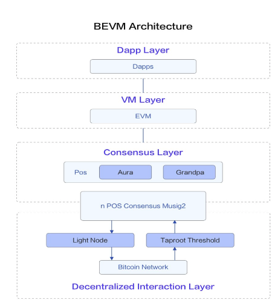
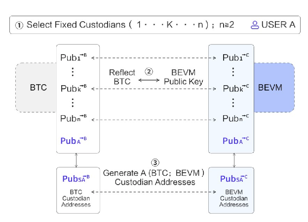
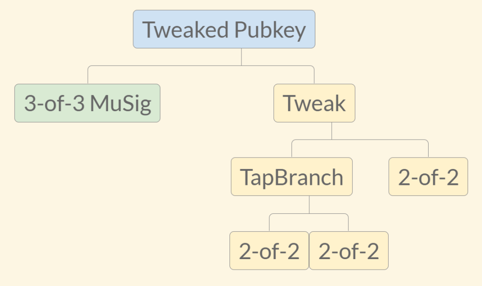

# BEVM

作为 BTC L2 调研系列的文章，本文会对 [BEVM](https://www.bevm.io/) 的技术架构做一个详细介绍和分析, 并对 BEVM 的信息做一个全面梳理.

## 概览和愿景

BEVM 是一个 `EVM 兼容的 BTC L2` 项目, 宣称可以实现`完全去中心化跨链管理`, 并且`使用 BTC 支付 L2 交易 Gas 费`. BEVM 官方宣称它完全符合 Bitcoin Magazine 提出的比特币 L2 三大标准.

BEVM 的核心技术架构被名为为 `Taproot Consensus`, 它包括比特币 Taproot 相关技术，BTC 轻节点 和 Substrate 区块链开发框架。Taproot 共识可实现更去中心化的 L2 跨链，以及 EVM 兼容的虚拟机。

BEVM 的目标是实现 BTC 扩容，为比特币资产发行，去中心化金融应用发展提供可能，从而促进比特币生态的发展. BEVM 长远还规划了 ZK-STARK Ultra Light Nodes, BEVM Stack, DBFX Protocol 等技术方向.

## 协议简介

### BEVM 技术架构

BEVM 将自身的核心技术架构命名为 `Taproot Consensus`, 它采用了以下技术实现:

1. Taproot 相关技术, 包括 Musig2， MAST， Schnorr signatures 等
2. 由比特币轻节点组成的 BFT PoS network. 该网络使用 Substrate blockchain framework 开发，它结合了 `Aura block production consensus` 和 `Grandpa BFT consensus`.
3. 使用 Signal Protocol 安全通信的 Threshold Nodes.

概括而言 BEVM 整体由 `跨链桥` + `PoS 共识的 EVM 侧链`组成.

### 跨链桥

跨链桥由`比特币 Musig2 协议 和 MAST 实现的多签账户` + `比特币轻节点(SPV)网络`组成. 多签账户负责托管用户的跨链资产和数据，轻节点网络负责验证比特币交易及数据, 并发送回跨的交易.

BEVM 采用 Taproot 升级带来的新技术 Musig2 和 MAST 实现多签账户，官方宣称其最大支持 1000 个参与方，每个参与方都是 BEVM 网络的 PoS 共识节点（非个人或实体），通过这种方式 BEVM 的跨连桥实现了更高程度的去中心化。

具体而言每个 PoS 共识节点都有一个专门用于 BTC 网络的私钥，每个私钥在 BTC 网络上都有一个公钥，利用 Schnorr 签名的特性，任意的多个公钥可以通过 Musig2 算法生成一个多签地址，然后叠加 MAST 技术可以实现 m-n 多签。

#### 跨入

当用户将 BTC 或 数据跨链至 BEVM 时，他们需要向多签账户发送一笔交易，BEVM 网络的每个 PoS 节点，同时也是一个 BTC 轻节点，他们会同步比特币网络的区块头，以及跨链相关的交易。通过这些信息可以验证跨链交易是否成功，确认成功后会在 BEVM 网络上铸造对应数量的 BTC 资产。

#### 跨回

当用户操作从 BEVM 跨回资产时, 用户需要先在 BEVM 发起跨回请求交易, 然后 PoS 共识节点会对请求进行投票, 当投票被 2/3 的节点通过后，节点通过 SPV 发送 BTC 交易, 将 BTC 资产或数据转回用户钱包。

2/3 的节点生成回跨交易签名是一个复杂过程，BEVM 采用 Musig2 方案，仅需通过两轮节点间通信即可完成，BEVM 通过 Signal Protocol 解决节点间通信的安全问题。

### EVM 链

EVM 链是使用 Substrate blockchain framework 搭建而成, 采用 BFT 算法的 PoS 网络. 每个 BEVM 的 PoS 节点同时也是一个 BTC 轻节点用于验证比特币数据和发送比特币交易. 具体而言该共识结合了 `Aura block production consensus` 和 `Grandpa BFT consensus`

按照 BEVM 官方的说法，BEVM 的 PoS 共识将会支持 BEVM token 和 BTC 的质押，用于 PoS 共识的选举和验证，意味着`跨链的 BTC` 和 BEVM token 都会为 BEVM 的 L2 提供安全性。

L2 的手续费 BTC Gas 会被奖励给 PoS 节点（具体奖励细则未定），同时整个网络也会 Issue 新的 BEVM token 来激励 PoS 节点和质押者。

BEVM 的主网已经于 2024 年三月底上线，平均区块时间为 6s, 区块浏览器为: https://scan-mainnet.bevm.io/。但目前 PoS 共识并未开放自由参与，而是由团队、领投机构、知名节点供应方参与，目前还处于中心化管理状态。

EVM 链使用 Substrate 框架搭建，意味着 BEVM 也支持 substrate API, 及相关钱包和工具.

## 安全性

BEVM 采用的跨链方案相比 ChainX 有了很大的改进，不仅大大增加了多签参与方的数量，还结合了 BEVM 的 PoS 共识网络，大大提高了跨连桥的去中心化程度。

不过根据 BEVM 白皮书所描述的跨链桥门限多签方案(Musig2+MAST), 受限于比特币区块及 MAST 叶子节点数量的限制，应无法达到 1000 个参与方，理论上为 100 多个，实际情况估计只能有几十个参与方。

另外该多签账户地址最终是由各个参与方地址所生成或决定的，无法支持参与方动态变化，意味着一旦 PoS 共识节点发生变化，跨连桥的多签地址也会发生变化，此时不仅涉及多签账户更换及资产转移问题，对用户体验也有很大负面影响。

BEVM 采用 Taproot 技术支持的多签 + PoS 共识，一定程度上提高了跨连桥的去中心话程度和安全性，但目前 PoS 网络还是采用中心化管理方式，未来是否会开放自由参与，还有待观察。

另外假设整个 L2 挂掉，用户应该是无法取回资产的，但 BEVM 团队表示会有应急方案，具体方案未知。

BEVM 宣称自己并非侧链，因为它的网络节点同时也是 SPV，如果 BTC 网络挂掉， BEVM 也无法正常运行，但 BEVM 无法共享比特币网络的安全性。

## 更多信息

1. 有两个网络 Canary 和 主网, Canary 相当于预发布网络, 但其上边的资产也是真实的 BTC
2. 据社区人员说 BEVM 即将支持 BRC20, rune 等资产跨到 BEVM, 具体时间未定。
3. 长远规划: ZK-STARK Ultra Light Nodes, BEVM Stack, DBFX Protocol 等
4. 收取的 BTC Gas fee, 除了奖励给 PoS 节点外, 还会用于激励 bido 上的质押者
5. BEVM token 预计 10.1 发布，届时它的详细经济白皮书也会公布
6. 支持 1559 机制，但销毁的 BTC Gas 如何处理未知。
7. 区块的空间是动态变化的，官方技术人员宣称 TPS 可以达到 300 左右
8. 目前据官方 mod 的说法，跨连桥的跨入（1个块转入三个块确认）和跨出时间大概为 30-60 分钟，跨出需要收取 BTC 手续费.

## 优势和不足

BEVM 的众多特性非常符合比特币 L2 的标准，不仅提高了跨链桥的去中心化程度，还为 BTC 生态带来 EVM 虚拟机，为 BTC 应用的拓展带来不少想象空间。

不过 BEVM 还有不少方面需要证明自己，例如 L2 网络最终演进为完全依靠 PoS 共识运行，需要时间证明跨链桥的安全性，另外 L2 对发展不仅仅是技术问题，BEVM 在社区和生态发展方面还比较落后，想要破局也并非简单之事。

## 协议详情

### 前身 ChainX

BEVM 的前身是 `ChainX`, 该团队从 2017 开始探索 `BTC 扩容项目`, ChainX-Network 是一条独立于 BTC 的`侧链`+`跨链桥`, 该链不具备 VM 功能（不支持智能合约）, 跨链过来的 BTC 只能实现转账. 跨链桥使用`比特币的多签脚本`实现, 最大仅支持 15 个多签参与方, 比较中心化. 该项目于 2018 年三月上线, 总共实现了 10W BTC 的跨链, 相比较闪电网络和 RGB 知名度不大.

随着比特币技术的演进(Taproot 升级), 以及 2023 年比特币生态(Ordinal, BRC20 等)的发展, 团队对 Chain-X 进行了反思和调整, 做出了以下三个方面的改进:

1. 实现 EVM 兼容: 为更多应用的开发提供空间, 也可复用以太坊生态工具及代码
2. 使用 BTC 支付 Gas 费: 为比特币赋予更多的使用场景
3. 采用更加去中心化的跨链方案: 采用 Taproot 升级带来的新特性

改进后的项目被重新命名为 `BEVM`, 从 2023 年开始研发和推进. 经历了测试网和 Canary 网络的测试，主网已于 2024 年三月底正式上线.

### Taproot Upgrade

Taproot 是比特币继隔离见证之后的又一重大软分叉升级, 该升级于 2021 年 9 月份生效，主要包含三个BIPs:

1. [BIP340-Schnorr signatures](https://github.com/bitcoin/bips/blob/master/bip-0340.mediawiki): 一种新的签名算法, 具有 ECDSA 签名的所有特性，并且具有可证明的安全性，以及体积更小，验证更高效的特性, 更重要的是 Schnorr 签名具有 线性 的特点, 可以很方便的进行密钥聚合.
2. [BIP341-Taproot: SegWit version 1 spending rules based on Taproot, Schnorr signatures, and Merkle branches.](https://github.com/bitcoin/bips/blob/master/bip-0341.mediawiki): 隔离见证 V1 版本的花费规则. 该规则由 Merkleized Abstract Syntax Trees, Taproot 和 Schnorr 签名组成, 使得比特币的多重签名更加隐私和高效.
3. [BIP342-Validation of Taproot Scripts](https://github.com/bitcoin/bips/blob/master/bip-0342.mediawiki): 该 BIP 对比特币的部分操作码进行了修改，并引入了新的操作码，以支持 Taproot 脚本的验证

Taproot 的升级为比特币带来多项改进，包括更高的隐私性，更高的效率，以及更多的扩展性. 其中很重要的一个应用是 `Taproot 门限签名`。

## 总结

BEVM 是 BTC L2 中兼容 EVM 的一个典型代表，从功能上来说，与其他基于 ZK Rollup， Op Rollup 或其他 EVM 兼容的 L2 项目类似，此类项目的关键是`跨连桥的安全性和去中心化程度`，BEVM 在此方面还是下了一定功夫。另外一个 L2 最终是否能脱颖而出，还要看其社区和生态的发展，BEVM 在这方面还有很多工作要做。对于 BEVM 的未来发展，我们还会持续关注。

## 参考资料

1. [Musig2 Paper](https://eprint.iacr.org/2020/1261) and related [BIP-327](https://github.com/bitcoin/bips/blob/b3701faef2bdb98a0d7ace4eedbeefa2da4c89ed/bip-0327.mediawiki#L3)
2. [BEVM whitepaper](https://github.com/btclayer2/BEVM-white-paper/blob/main/BEVM%20%E2%80%94%20An%20EVM-compatible%20Bitcoin%20Layer%202.pdf)
3. [比特币 Layer2 跨链桥多签资产托管案例解析](https://foresightnews.pro/article/detail/55469)
4. [Taproot 升级详解](https://www.btcstudy.org/2021/11/02/the-taproot-upgrade-explainer-from-Suredbits/)
5. [Taproot Consensus: A #BTClayer2 technological solution developed by BEVM](https://bevm-blog.webflow.io/post/taproot-consensus-a-btclayer2-technological-solution-developed-by-bevm)
