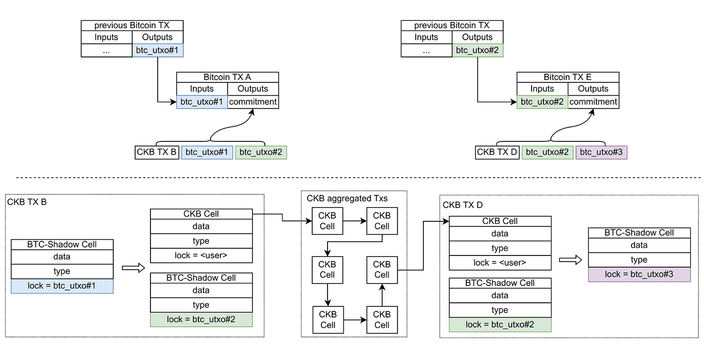

- [RGB](#rgb)
  - [概述与愿景](#概述与愿景)
  - [协议速览](#协议速览)
    - [基础工作方式](#基础工作方式)
    - [如何在链上指示RGB操作](#如何在链上指示rgb操作)
    - [客户端验证](#客户端验证)
  - [信任与安全](#信任与安全)
  - [杂项](#杂项)
    - [虚拟机](#虚拟机)
    - [可扩展性](#可扩展性)
    - [TVL](#tvl)
  - [RGB小结：优势与劣势](#rgb小结优势与劣势)
  - [更多细节](#更多细节)
    - [状态机复制与链下计算引擎](#状态机复制与链下计算引擎)
    - [承诺方案](#承诺方案)
    - [Proof of Publication](#proof-of-publication)
  - [相关资源](#相关资源)
- [RGB++](#rgb-1)
  - [概述与愿景](#概述与愿景-1)
  - [协议速览](#协议速览-1)
    - [工作原理](#工作原理)
    - [交易流程详解](#交易流程详解)
  - [信任与安全](#信任与安全-1)
  - [RGB++小结：优势与劣势](#rgb小结优势与劣势-1)
  - [更多细节](#更多细节-1)
    - [同构绑定](#同构绑定)
    - [交易折叠](#交易折叠)
    - [global state 与其带来的安全风险](#global-state-与其带来的安全风险)
  - [相关资源](#相关资源-1)
  - [附录 讨论：EVM中RGB执行引擎的伪代码构建](#附录-讨论evm中rgb执行引擎的伪代码构建)

> 本文意图深入探讨各种技术概念并探索协议设计，同时我们欢迎读者主动参与为我们的内容提供反馈和观点。由于每位作者的专业兴趣点不同，每篇文章可能不会涵盖各个协议的全部细节，因此我们特别期待并欢迎读者的详细探讨并补充我们的内容。
>
> 请注意，虽然我们在准备这篇文章时已经尽力保证内容的准确性，但是因为诸多可能的因素，其中可能仍存在错误或不准确之处，我们非常乐于相关错漏接受各位的指正。这样的共享与学习过程可以帮助我们共同进步并推动技术的发展。

## RGB

### 概述与愿景

RGB是一个建立在比特币区块链之上的智能合约平台，它通过客户端验证范式，实现了在比特币网络上运行智能合约的能力。RGB的核心特点包括数据的链下存储、以及使用比特币脚本作为安全和所有权控制系统。该平台旨在提供一个超越传统以太坊类智能合约系统的解决方案，通过分离智能合约的发行者、所有者和状态演变的概念，为去中心化应用和数字资产管理提供了一个更加分层、可扩展、私密和安全的环境。

### 协议速览

> 我们在这部分会尽量避免在内容中包括协议的复杂的细节。使用尽量简单化的方式解释协议的工作方式。

#### 基础工作方式

> UTXO 全称为 Unspent Transaction Output，为比特币中的基础概念。不熟悉的朋友可以先阅读 [wiki 条目](https://en.wikipedia.org/wiki/Unspent_transaction_output)。我们不在这里对UTXO进行详细解释。

RGB作为智能合约平台，其整体的设计均与UTXO绑定。我们先以一个例子说明其工作原理。假定通过RGB发行了某种资产100枚，那么该资产会与某个UTXO绑定。有权花费该UTXO的用户能在花费UTXO时，才可以在交易中指定RGB资产如何转移（RGB称之为**所有权**）。如下图


UTXO1上绑定了100枚RGB资产。将UTXO1花费后，得到了UTXO2与UTXO3（黑色箭头）。交易中同时包含了RGB资产如何转移的指示（红色箭头），将100分为了30与70两部分，前者与UTXO3绑定，后者与UTXO4绑定。

> RGB合约旨在实现通用的智能合约逻辑，因此合约逻辑与UTXO的转移是解耦的。我们可以看到，RGB资产的转移不必与UTXO的花费绑定。

而因为UTXO只能被花费一次，所以与该UTXO绑定的RGB资产也只能被转移一次。如果比特币安全，UTXO无法被双花，RGB资产也无法被双花，从而保障了协议安全。

> RGB将这一设计称作[一次性封条](https://blackpaper.rgb.tech/consensus-layer/3.-client-side-validation/3.2.-single-use-seals)。

#### 如何在链上指示RGB操作

为了隐私性与智能合约的表达能力，RGB没有简单地将明文写在比特币脚本中，而是在链上提交一个与操作相关的哈希值（术语称为“承诺”）。RGB的协议参与方可以在链下验证链上的哈希值是否与该操作匹配。

> 我们在这里不讨论承诺是如何提交的。但就最终结论而言，链上总会出现一个相关的承诺值。

这种方式保障了RGB交易的隐私性，对于非RGB协议的参与方而言，它所能观察到的链上行为如下图：


可以看到，由于无法通过哈希值反过来获得原始的RGB操作，非参与方甚至无法得知RGB资产的存在。

同时由于链上仅包含了操作的哈希值，因此提交到链上的数据大小始终是恒定的，这使得链下的复杂操作成为了可能，同时也仅有常数级别的费用开销。

#### 客户端验证

RGB提交到链上的仅包含哈希，交易时验证哈希是否有效则是协议安全的基础。RGB通过称之为“客户端验证（client-side validation，CSV）”的方式保证交易的有效性。RGB相关的数据全部在链下由交易方保存，在交易时由交易方自行决定数据如何传递，在交易数据传递后交易方可以根据交易数据在本地客户端验证交易的有效性。

我们用示意图表明客户端验证做了什么（注意：*为了理解的方便，该图**没有精确地表示出RGB协议的所有细节***）。


我们仍然使用[基础工作方式](#基础工作方式)中的例子说明。Bob 是 UTXO1 的所有者，他需要将70枚RGB资产转移给UTXO4的持有者Alice。

- 在交易的过程中，产生了新增数据data2，Alice因此接收了Bob发送的所有数据data0，data1与data2。
- Alice阅读获得的RGB数据data0，data1，data2，得知了RGB资产的状态变化（蓝色虚线）。
- Alice会验证链上是否存在RGB数据（data2，data1...）的哈希（绿色虚线），以及相应交易是否被比特币确认。从而确保RGB数据的有效性。Alice需要验证所有的RGB数据是否有效，即从RGB合约被创建，也就是data0对应的链上交易（图中未画出），到最新的交易。Bob在Alice接收到资产时也进行过相同的验证。

客户端保障隐私性的方式非常极端。我们可以想见，即时是RGB合约的部署者（持有data0），如果无法拿到data2，他也无法知晓Bob与Alice间发生的这笔交易。

### 信任与安全

> 由于“安全”是一个比较重要的问题。在这里我们会从“信任”的角度分析用户需要信任的协议与应用中的各环，并给出分析。
> 
> 如没有另外提及，我们认为协议中使用的经典密码算法是可信的（不考虑量子计算机）。

- 用户需要信任比特币网络。
  - 比特币上的交易不会被双花。否则RGB资产也会被双花。
  - 比特币交易不会被审查。否则RGB交易可能无法上链。
- 用户需要信任链下RGB的执行引擎（包括虚拟机与智能合约设计）。用户的RGB资产与UTXO绑定，但在链上仅有RGB操作的哈希提交，而没有与比特币脚本的交互，因此链上**无法以任何方式**确认RGB交易是否有效。而如果链下执行引擎出错（如执行引擎的代码错误，或合约的逻辑错误），将有可能导致链下产生无效的状态，或提交的哈希无法与RGB状态对应。这种情况下，一旦UTXO交易被花费，用户手中的状态无法被正确验证，将会导致资产丢失。

我们可以看到，RGB协议并没有为用户引入过多的信任负担。用户可以几乎自行验证协议的每一个部分，确保协议在正确运作。但这同样也为用户的使用带来了负担。

### 杂项

#### 虚拟机

RGB实现了一个图灵完备的虚拟机 [AluVM](https://www.rgbfaq.com/glossary/aluvm)。

#### 可扩展性

每笔RGB交易与一笔比特币交易绑定，这限制了RGB的处理能力。但[Bifrost协议](https://www.rgbfaq.com/glossary/bifrost)也被提出，作为比特币闪电网络的扩展，使得RGB支付可以在闪电网络上进行。

#### TVL

由于RGB的隐私性，TVL尚无可以统计的方法。

### RGB小结：优势与劣势

优势：

- 隐私性：RGB在链上仅提交哈希，以客户端验证的方式保证了交易的隐私性。除交易方外其他人无法获知交易详情。
- （复杂合约的）链上交易费用：在链上仅提交交易哈希，链上所需的交易费用与合约逻辑无关。
- 信任：协议中的额外信任需求极少，用户几乎可以验证协议中的一切。

劣势：

- 数据保存：用户交易时需要保存有RGB数据，数据丢失等同于资产丢失。
- 交易时需要多方交互。当某一方离线时，交易变得不可能。这也使得客户端的设计变得困难。
- 验证成本高：每次交易时，客户端都要验证状态，当交易次数增加时，验证开销可能会变得极为庞大。此外这一验证过程也需要验证比特币主网数据，因此也会增加本地的存储开销（本地保存）或一定的网络开销（与RPC节点或相关服务方交互）。

RGB的这些劣势加大了客户端构建的难度，也使得用户的学习门槛变得极高。

### 更多细节

> 这部分我们会讨论协议中重要性处于次位的内容。这部分会包含一些技术细节与讨论，供感兴趣的读者参考。

#### 状态机复制与链下计算引擎

区块链的其中一个核心议题仍然是如何保证各个节点存储的账本一致。我们在这里先介绍比特币，甚至所有区块链都在应用的一个范式：通过状态机复制实现容错服务。这个范式被广泛地应用于分布式服务的构建，用于解决多个副本的一致性问题。到实际的应用场景中则例如分布式数据库，再如这里讨论的区块链，都在应用这套范式。而它的实现方式也非常简明：

1. 所有副本以某一状态作为初始态。
2. 状态转换：
   1. 在接收新的输入前，副本状态保持不变。
   2. 在状态s接收到输入i后，副本会转换为新状态s'。且这一状态转换是确定性的：给定相同的副本状态s与输入i，副本的新状态s'是一致的。
3. 通过这样的方法，只要副本具有相同的初始状态s0，并保证每个副本的输入i0，i1，i2...in相同且**顺序一致**，那么最终所有副本的状态都能保持一致。

我们借用比特币的语境，重新阐释一下上面的解释：

> 这里我们使用“状态”代指比特币中的所有 UTXO

1. 所有比特币客户端以创世区块作为初始状态。
2. 状态转换：
   1. 在接收到新的交易（区块）前，比特币账本的状态保持不变。
   2. 接收到新交易（区块）后，账本会转换为新状态。且这一转换过程是确定性的，给定相同的账本状态与相同的交易（区块），新的账本状态是一致的。
3. 通过这样的方法，只要所有比特币客户端都能以创世区块作为初始态，并以相同的顺序处理相同的交易（区块）i0，i1，i2...in，那么最终所有客户端所持有的账本状态是一致的。

而这里最核心的问题在于如何保证所有节点都能决定一批相同顺序的交易（区块），换言之，即共识，这也是区块链抵御双花攻击的基础。

RGB这种链下计算引擎做的事情在于利用比特币的共识来维护交易顺序，从而避免双花。而状态与状态转换都在链下维护。这种范式的优点在于将执行层与共识层进行了解耦，使得不升级区块链便能扩展功能。但这也导致共识层在执行时不会进行逻辑验证，当链上提交的数据与链下的交易引擎逻辑不符时，交易也并不会被拒绝，因此容易导致丢失资产等情况。也有这样的观点：RGB是“寄生”在了比特币上。RGB同样也可以运行在其他UTXO-based的区块链上。

铭文、符文等协议也是类似的范式。它们甚至面临一个更严重的问题，那就是生态初期并无完全一致的标准，链下执行引擎（indexer）存在不同实现，执行结果难以验证。

#### 承诺方案

承诺（commitment）方案是密码学中的概念。它允许某人在选择某值后将其隐藏起来时进行承诺，并可以在随后揭示已承诺值。

承诺方案有两个基本性质：

- 承诺值所对应的原值只会有一个。在RGB中，链上的承诺只可能对应唯一的RGB操作。（如果无法保证，则存在可能的双花）。这个性质被称作binding。
- 他人无法根据承诺值算出所选择的值。在RGB中，看到链上承诺的他人无法知晓对应的RGB操作，保证了隐私性。这个性质也被称作hiding。

哈希是构造承诺方案的常用工具。例如我们所熟知的Merkel Tree是一个承诺方案。在区块链的其他应用中，承诺也是常见的工具，例如ENS的[两阶段注册](https://docs.ens.domains/registry/eth#registering-a-name)中也用到了承诺，用于避免注册的域名被他人抢跑。

#### Proof of Publication

我们可能会意识到一个问题，在RGB的客户端验证中，交易的双方是不可能得知资产的全局状态的，例如上述的例子中，Bob持有100枚资产，但全局可能存在200枚资产。在这种情况下，合约运行不会造成什么问题吗？

RGB称这一问题的解决方案为[proof of publication](https://blackpaper.rgb.tech/consensus-layer/3.-client-side-validation/3.1.-proof-of-publication)。 其核心思想是分布式系统中状态验证不需要由所有参与方去全局执行，而只需涉及特定状态转换的各方进行验证。采用这种方法，状态转换并非发布到全局，而是保证相关参与方知晓后（如签名），被编码成一个简短的密码承诺。如下图，合约G的全局状态为所有红色与灰色的节点（代表某次历史交易），然而验证P的状态只需要与P相关的红色节点部分。

需要注意，这一设计也对智能合约的设计提出了要求。


### 相关资源

- [RGB Blackpaper](https://blackpaper.rgb.tech/)
- [RGB website](https://rgb.tech/)
- [CoinEx Research: A Brief Analysis of RGB: A Scalable, Confidential Smart Contract Protocol Built on Bitcoin](https://www.coinex.com/en/blog/3654-a-brief-analysis-of-rgb-a-scalable-confidential-smart-contract-protocol-built-on-bitcoin)
- [RGB presentation slides](https://github.com/LNP-BP/presentations/tree/master/Presentation%20slides)

## RGB++

### 概述与愿景

RGB++由Nervos CKB的Cipher提出。Nervos CKB 是一条基于UTXO模型（CKB中称之为Cell）的公链。RGB++ 是一个基于 RGB 的扩展协议，它通过同构绑定将比特币 UTXO 映射到 Nervos CKB 的 Cell 上，并利用 CKB 链和 Bitcoin 链上的脚本约束来验证状态计算的正确性和变更所有权的有效性。RGB++ 希望解决原 RGB 协议在实际落地中的技术问题，将客户端的工作转由 CKB 链承担。

### 协议速览

> 我们在这部分会尽量避免在内容中包括协议的复杂的细节。使用尽量简单化的方式解释协议的工作方式。

#### 工作原理

RGB++是RGB的拓展协议，因此我们推荐读者在阅读以下内容前，确保已经了解了RGB协议的工作模式。而RGB++的核心在于将原有的RGB的客户端验证范式改为直接公开到Nervos CKB链上，并由Nervos CKB充当执行引擎。我们仍然复用在RGB协议中使用的例子进行解释，如下图（**注意，该图仅用于示意RGB++基础的工作方式，为了理解的方便存在一些不准确**）。


图中Bob向Alice发送70枚RGB资产。与之前的客户端验证不同，此时所有的RGB数据都被提交到了CKB链上公开，同时CKB也会作为交易引擎执行并保存RGB合约状态。

- Bob可以直接通过Nervos CKB得知自己拥有的UTXO1上绑定了100枚RGB资产。
- 当Bob向A发送资产时，他不必再将data0与data1也提交给Alice，Alice可以自行在链上读取当前的合约状态或历史数据。
- 在比特币上提交承诺的交易（0x345AB...D7654）确认后，Bob可以向CKB提交包含了RGB数据（data2）的交易，CKB的节点会同时运行比特币的轻节点，确认比特币链上存在承诺。
- 在交易被CKB执行后，Alice能够通过CKB读取到自己持有的UTXO4上此刻被绑定了70枚RGB资产。

可以看到，原有RGB的客户端的绝大多数功能现在被CKB链承担了，用户端在RGB++中不必承担繁重的数据储存与验证成本。而负面影响则是RGB协议的隐私性当前不复存在。

#### 交易流程详解

RGB++协议的[白皮书](https://github.com/ckb-cell/RGBPlusPlus-design/blob/main/docs/light-paper-cn.md#rgb-%E4%BA%A4%E6%98%93%E6%B5%81%E7%A8%8B)对交易的流程作了非常详尽的解释，这里我们借用原文的表述，结合上图解说。

- 链外计算
  - Bob 选中下一次要使用的[一次性密封条](#协议速览)（即btc交易要花费的UTXO），例如 UTXO1。
  - Bob 链外计算并生成一笔将要发送到 CKB 上的 RGB++ 交易: CKB_TX。CKB_TX 中包含RGB状态变更所需数据。
  - Bob 链外计算承诺值 `commitment`(0x345AB...D7654)
- BTC交易提交
  - Bob 生成并发送一笔比特币交易，花费UTXO1，通过 OP_RETURN 加入上述的`commitment`(0x345AB...D7654)。
- CKB 交易提交
  - Bob 发送 `CKB_TX` 到 CKB 链上
  - 用户最新状态由 `CKB_TX.output.data` 维护
  - 下一次状态变更（Alice）需要使用 UTXO4, `CKB_TX.output`
- 链上验证
  - Bitcoin UTXO1 仅被花费一次。
  - CKB 通过 Bitcoin Light Node，验证承诺值在比特币链上，且花费了正确的 UTXO。
  - CKB 验证 CKB 上合约的状态转移符合预先约定的合约规则。

### 信任与安全

> 由于“安全”是一个比较重要的问题。在这里我们会从“信任”的角度分析用户需要信任的协议与应用中的各环，并给出分析。
> 如没有另外提及，我们认为协议中使用的经典密码算法是可信的（不考虑量子计算机）。

- 用户需要信任比特币网络。
  - 比特币上的交易不会被双花。否则RGB(++)资产也会被双花。
  - 比特币交易不会被审查。否则RGB(++)交易可能无法上链。
- 用户需要信任CKB的交易执行引擎。理由同RGB。
- 用户需要信任CKB能会访问Bitcoin近行交易验证。否则非法状态将有可能上链。
- 用户需要信任CKB不会审查用户交易。如果用户交易被审查无法上链，将无法获得交易执行结果。但是此时也能够将协议由RGB++回退到RGB，重新启用客户端验证的范式，离线计算交易执行结果。
- 用户需要一定程度信任CKB的一致性（一致性可以理解为被确认的交易是否会回滚）。
  - 对应比特币上的承诺，恶意的攻击者无法构造出另一笔CKB交易，包含不同的执行内容。用户不必担心CKB的一致性导致RGB资产被双花。
  - 但用户需要考虑到，如果CKB回滚可能导致CKB交易数据丢失，而用户未保存相应交易数据，将可能进而导致RGB++数据永久丢失。

需要注意的是，上面的信任分析没有考虑RGB++计划引入的扩展功能，例如交易折叠、global state等功能。

### RGB++小结：优势与劣势

RGB++是RGB的扩展，我们先分析RGB++相比RGB的优劣。

优势：

- 用户不必自行保存数据，而是由CKB保存。
- 执行引擎的绝大部分职责由CKB担当，用户能够从CKB链上读取RGB合约的最新状态，也不必每次从头运行RGB数据。
- CKB通过Bitcoin轻节点自动验证交易，用户不必自行验证。

劣势：

- 交易不再具有隐私性。
- 交易需要在CKB上执行。限制了RGB++合约执行复杂交易的能力。同时需要根据交易的复杂性支付费用。
- 需要引入额外的对CKB链的信任依赖。

RGB++并没有完全继承RGB的优点，它牺牲了RGB方案的隐私性，并需要用户的部分额外信任，但在此基础上大幅提升了RGB协议的可用性。

而作为比特币的扩容方案，RGB++有如下优势与劣势：

优势

- 信任：RGB++中CKB链充当了比特币链下公共计算引擎的作用，负责验证与运行协议，而**无需跨链桥**。协议中引入的额外信任需求非常轻度，用户容易验证CKB链是否在作恶，同时也有着回退到客户端验证的选项。

劣势

- 没有很好地解决可扩展性问题。（RGB++ Light Paper中提出的交易折叠可以一定程度上缓解这个问题，感兴趣可以阅读后文）。

### 更多细节

> 这部分我们会讨论协议中重要性处于次位的内容。这部分会包含一些技术细节与讨论，供感兴趣的读者参考。

#### [同构绑定](https://talk.nervos.org/t/rgb-protocol-light-paper/7733#rgb-5)

在以上部分，我们还没有讲解Nervos CKB的具体架构。其他区块链，如图灵完备的EVM兼容链从理论上也能做到同样的事情。在本文附录中对此有简要的讨论。

CKB能充当RGB计算引擎，其最大的优势在于CKB中的Cell与比特币的UTXO是同构的，这使得CKB可以复用RGB协议中的诸多设计，如通过proof-of-publication的设计避免状态争抢，使得RGB的相关计算可以回退到链下进行，避免协议执行中对CKB链的过多依赖。


#### [交易折叠](https://talk.nervos.org/t/rgb-protocol-light-paper/7733#h-13)

RGB++将有可能将比特币上的一个承诺值对多笔（而非单笔）CKB交易进行承诺，从而实现类似ROLLUP的效果，提升可拓展性。



#### global state 与其带来的安全风险

RGB++中为了增强合约的表达能力，引入了global-state cell，RGB++的白皮书“共享状态与无主合约”中提到了这一点：

> 考虑 CKB 上存在一个全局状态的 Cell，用来管理多用户共享的状态。...全局状态由无主合约管理，所谓无主合约指的是任何人在满足合约的约束前提下都可以对状态进行变更，而不要求指定的数字签名提供方进行变更。...
>
> 这里的平庸实现指的是 Global-state cell 有被其他用户占用的风险，这样 CKB TX 就会因为指定的 Global state utxo 不存在而无法成立。...
>
> 为了解决上述问题，我们引入了 Intent Cell 作为中介。用户将自己希望执行的动作确定性地写入 Intent Cell，后者则可以通过第三方聚合器的协作与全局状态 Cell 交互，批量将多方的 intent 进行计算，并将交互结果合并到标准的 shadow cell 上。

这一点其实带来了潜在的安全问题。这一问题来自于RGB的proof-of-publication设计。该设计使得只保证单一路径上状态转换的偏序，而非全部状态转换的全序，就能保证协议安全。

而一旦引入了global-state等设计，则会改变这一点，导致非同一路径上的交易A与B的公开顺序对执行结果造成影响，考虑下面描述的场景（图参考上图）：

1. 交易A与B的承诺都已经先后上链BTC。
2. 但交易A对应的CKB交易因为某些原因一直未能上链（例如CKB链上的审查攻击）。
3. B交易在执行后已经对global state进行了修改。
4. 交易A上链CKB后A交易很可能产生不同的执行结果甚至导致执行失败，造成资产丢失等后果。


而白皮书中提出的Intent Cell方法并不足以解决这个问题。Intent Cell能保证的是提交到CKB的交易能通过验证，但却无法确保A与B都能被即时提交到CKB链上。（这也是先承诺后公开的一类方案需要考虑的重点）。在原始RGB方案中，只要客户端的正确构造了状态转换与承诺，合约就能够顺利运作，而RGB++中，在比特币上先提交的承诺的有效性却反过来被CKB控制了，为RGB引入global-state cell这一设计很有可能从安全性的角度不是一个好想法。

### 相关资源

- [RGB++ Protocol Light Paper](https://talk.nervos.org/t/rgb-protocol-light-paper/7733)
- [RGB++ 合约规范](https://github.com/ckb-cell/RGBPlusPlus-design/blob/main/docs/locscript-design-prd-cn.md)

### 附录 讨论：EVM中RGB执行引擎的伪代码构建

我们在文中提到，图灵完备的EVM也能作为RGB架构的执行引擎。下面通过 ***伪代码*** 实现了一个demo合约，用于在EVM链上部署一个类RGB++的执行引擎。

BTC_STATE 是一个特殊实现的合约，我们假定它可以（通过一个轻节点）读取比特币链上已确认的信息。同时任何人都能手动通过RGB_CONTRACT的openCommitment将交易data公开，将EVM作为执行引擎，执行RGB交易。这里我们假定交易的承诺值是通过提交到链上的。

```sol
// BTC_STATE can read bitcoin confirmed state
contract BTC_STATE {
  stuct TXO {
    uint256 btcTxId;
    uint256 outputIndex;
  }
  // a bitcoin tx will have at most 1 OpReturn
  function readBitcoinOpReturn(uint256 btcTxId) returns (bytes);
  // or
  function readBitcoinTransactionOutputScript(TXO txo) returns(bytes);

  function isBitcoinTransactionOutputSpent(TXO txo) returns(boolean);
  // ...
  function readBitcoinOrdinalIndex(TXO txo, uint256 satoshiIndex) returns (uint256);
  // ...
  function readBitcoin...(uint256 btcTxId) returns (bytes);
}

contract RGB_CONTRACT {
  struct RGB_DATA {
    TXO input; // could be multiple, only for reference
    TXO output; // could be multiple, only for reference
    bytes payload;
  }
  mappinp(uint256 => bytes) utxoStatus;
  mappinp(uint256 => boolean) utxoPermission;
  function openCommitment(RGB_DATA calldata data, bytes32 salt) public {
    isValidOpen(data, salt);
    utxoPermission[calcTxoHash(data.input)] = false;
    utxoPermission[calcTxoHash(data.output)] = true;
    execute(data.payload);
  }
  function calcTxoHash(TXO txo) pure returns (uint256);
  function calcCommitment(RGB_DATA calldata data, bytes32 salt) pure returns (bytes32);
  function execute(bytes payload) internal;
  function isValidOpen(RGB_DATA calldata data, bytes32 salt) {
    require(utxoPermission[calcTxoHash(data.input)], "from utxo should have permission");
    require(
      calcCommitment(data, salt) == BTC_STATE.readBitcoinOpReturn(data.input.btcTxId)
    );
    _;
  }
}
```
