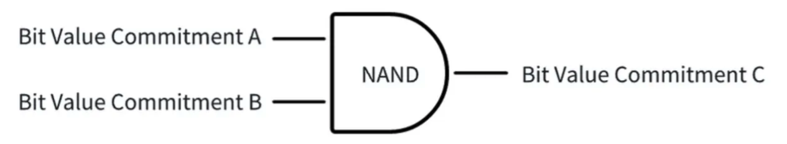
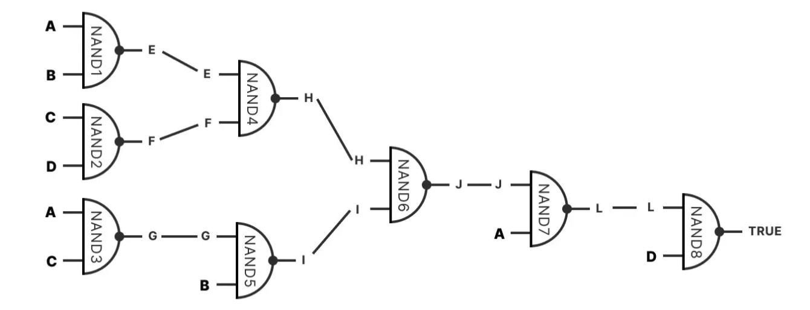
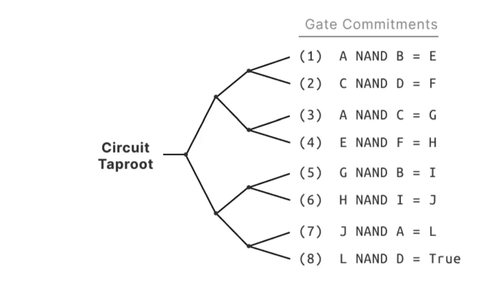
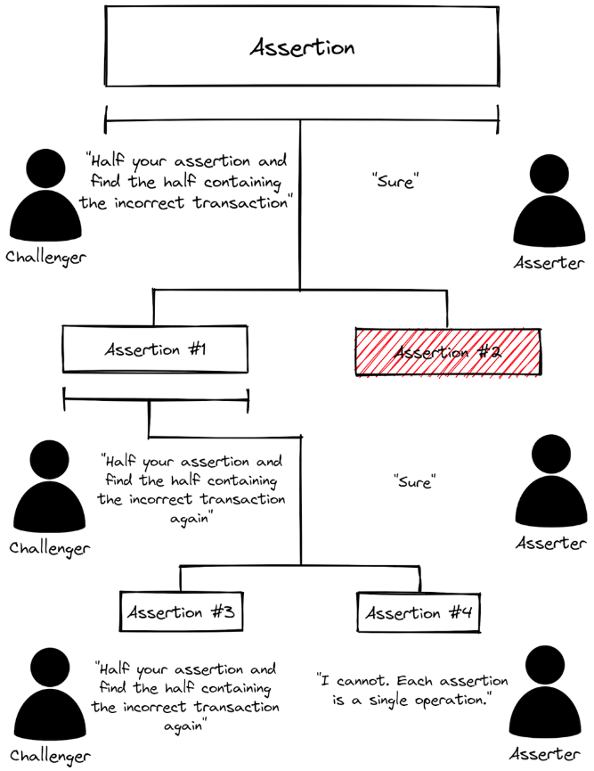
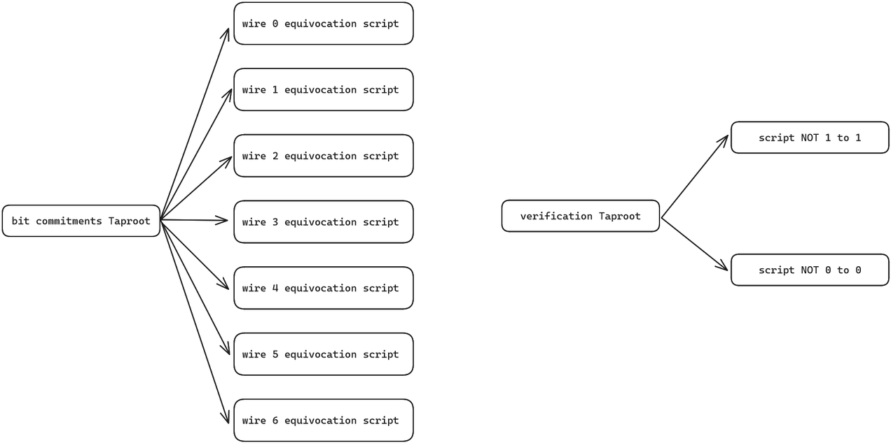
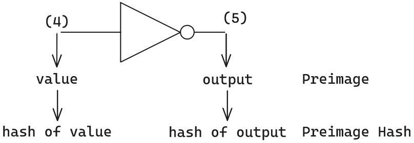

# SatashiVM

## 介绍
本文主要用通俗易懂的方式介绍 SatoshiVM 的基本情况，以及技术架构和工作原理。
## 概要
SatoshiVM 是一个分布式的比特币 ZK Rollup 第二层解决方案，与以太坊虚拟机（EVM）生态系统兼容，使用原生 BTC 作为燃料。由于兼容EVM，使得比特币具备了使用EVM功能的能力，使比特币生态系统能够发行资产和开发EVM支持的应用程序，为新生态系统的演进带来很多可能性。

SataoshiVM主网上线分两个阶段：alpha 主网和 主网，其中 alpha 主网已于 2024 年 3.15日 上线 ，defillama 显示当前 tvl 为 1.37m。主网计划在 2024 年 Q4 上线。
## 协议速览

### 特点
SatoshiVM 具有以下技术特点：

1. ZK EVM：SatoshiVM 是一个多功能的 ZK Rollup，采用 EVM 进行链下计算。这意味着用户可以以与以太坊类似的方式与SatoshiVM 进行交互，开发者可以像在以太坊上一样构建在 SatoshiVM 上的应用程序。
2. ZK Rollup：SatoshiVM 利用 Rollup 技术将多个交易捆绑成一个批次，并在比特币主网络上作为单个交易进行验证。 这确保与比特币主网络相同的安全级别，保证数据的有效性和可用性。
3. 零知识欺诈证明：SatoshiVM利用Taproot和BitcoinScript等技术，在不改变比特币网络共识规则的情况下，进行链上合约验证，从而完成欺诈证明的计算。
4. 数据可用性：SatoshiVM必须在比特币主网络上发布交易数据，使任何人都能验证在比特币主网络之外执行的计算的正确性。
5. BTC本地燃料：SatoshiVM将本地BTC用作EVM的燃料。类似于使用ETH作为第二层的ETH OP Rollup / ZK Rollup解决方案，SatoshiVM利用BTC作为EVM交易的燃料。

### 架构

SatoshiVM 链由三个层组成：

结算层(比特币网络)：
- 比特币作为结算层，桥接和Rollup脚本部署在比特币网络上。
- 提供数据可用性、排序和验证证明。
- 允许用户和dApps在比特币和SatoshiVM之间发送消息和资产。

排序层：
- 包括执行节点和Rollup节点。
- 执行节点负责
  - 执行用户提交给SatoshiVM排序器和L1桥接脚本的交易，然后生成L2区块。
- Rollup节点负责
  - 处理批量交易，发布交易数据和区块信息到比特币网络以确保数据可用性。
  - 向比特币网络提交有效性证明以进行最终性验证。

证明层：
- 包括协调器、证明者池和验证者。
- 协调器分配证明任务给证明者池，并将生成的证明传递给Rollup节点。
- 证明者池负责生成验证L2交易正确性的有效性证明，然后传递回协调者。
  - 证明者生成两笔有效性证明相关的Taproot交易（参考 BitVM 方案）
    - 用于验证发布的 Preimage Commitment 的脚本，称为 bit commitments Taproot
    - 用于验证公开披露的执行轨迹是否正确的脚本，称为 verification Taproot

## 信任和安全

SatoshiVM使用ZK Rollup技术将多个交易捆绑成一个批次，并在比特币主网上作为单个交易进行验证。这保证了与比特币主网络相同级别的安全性、数据有效性和可用性。

ZK Rollup 还使用零知识证明来验证链下计算的正确性，而不会透露细节。

SatoshiVM 支持用户直接发送相应格式的到交易到 L1 实现抗审查性。

## 协议细节

SatoshiVM的核心是Rollup 交易的验证，SatoshiVM 是基于 BitVM 的验证解决方案进行的。并在其基础上进行了一些改进。

### BitVM
BitVM 是一种计算范式，用于表达图灵完备的比特币合约。这不需要对比特币网络的共识规则进行任何更改。与在比特币上执行计算不同，它们仅仅是被验证，类似于乐观 Rollup。证明者声明某个给定的函数对某些特定的输入求值得到了特定的输出。如果该声明是错误的，那么验证者可以进行简明的欺诈证明并惩罚证明者。使用这种机制，任何可计算的函数都可以在比特币上进行验证。

BitVM的详细介绍可以参看[BitVM白皮书](https://bitvm.org/bitvm.pdf)

#### BitVM 电路

在 Arbitrum 的交互式防欺诈协议中，争议方进行多轮通信，以不断细分特定的交易指令，直到他们定位有争议的操作码。然后，该操作码及其输入和输出结果直接在以太坊区块链上执行以进行验证。此过程确定哪一方的声明是正确的，并惩罚恶意方。

在BitVM 方案中，由于比特币脚本的简单性，无法像在以太坊第 2 层解决方案中那样直接验证 EVM 操作码。因此，采用了另一种方法：从任何高级语言编译的操作码再次解码为逻辑门电路的形式。然后，使用Bitcoin Script来模拟这些逻辑门电路的操作。这允许间接模拟虚拟机操作码（例如EVM的操作码）对比特币区块链的操作影响。

从编译原理的角度去理解BitVM方案，它是把 `EVM / WASM / Javascript` 操作码，转译为Bitcoin Script的操作码，逻辑门电路作为 “EVM 操作码 ——> Bitcoin Script操作码” 两者之间的一种中间形态（IR）。

#### 证明与挑战

##### 位值承诺

位值承诺是BitVM的基础组件。它允许证明者将特定位的值设置为“0”或“1”。特别是它允许证明者在不同的脚本和 UTXO 之间设置变量的值。这很关键，因为这使得它可以通过将比特币的虚拟机执行时间分割成多个交易来扩展执行运行时。

承诺包含两个哈希值，hash0 和 hash1。在稍后的某个时刻，证明者通过揭示 preimage0（hash0 的原像）将位的值设置为“0”，或者通过揭示 preimage1（hash1 的原像）将位的值设置为“1”

逻辑门的每条线都可以有独立的位承诺，例如可以用 hash(0xa0) 表示 A 线的 0值承诺, hash(0xa1) 表示 A 线的 1 值承诺；hash(0xb0) 表示 B 线的 0 值承诺，hash(0xb1) 表示 B 线的 1 值承诺。

> 位值承诺简单理解就是 将 值0 或者 值1 用一个随机数来表示，该随机数就是承诺。需要注意的是每个门的输入和输出都可能有不同的位值承诺。

##### 二进制电路承诺

bitvm 将 逻辑门电路承诺 Merkel 化，然后将 Merkel Root 称为 Binary Circuit Commitment。

假如有二进制电路如下：

则二进制电路承诺就是根据每个逻辑门创建的 Merkel Root

#### 挑战与响应

bitvm 将 位值承诺树 Root 发布为 Bit Commitments Taproot 交易, 将 二进制电路承诺 发布为 Binary Circuit Commitment Taproot 交易。

<!-- 挑战者在要求证明者出示证明时，证明者只需要出示 数据片段 + Merkle Proof /Branch 即可。这种可以极大程度压缩 上链 的数据量，且能保证 上链 数据真的存在于MAST树上。而且，仅在BTC链上公开小部分数据片段+Merkle Proof，而不是公开所有数据，能起到很好的隐私保护效果。 -->

当争议发生时，挑战者在BTC链上声明，自己要挑战证明者发布的哪个 Binary Circuit Commitment Taproot，然后要求证明者揭示Root对应的某段数据。之后，证明者出示默克尔证明，通过二分法的方式反复在链上披露Merkel树的小部分数据片段，直到和挑战者共同定位到有争议的逻辑门电路。

### SataoshiVM 电路
SataoshiVM 基于 BitVM方案。SatoshiVM 采用 Bristol format 来表达其逻辑门电路结构。

BitVM 中的 Binary Circuit Commitment 在 SatoshiVM 中称为 verification taproot

### SataoshiVM 证明挑战
SataoshiVM的证明挑战方式与BitVM不同，SatoshiVM显著简化了“多轮交互以确认哪一小块数据有问题”的过程，只需要一轮交互即可完成验证过程。在BitVM和任意中，这个过程可能持续几个小时。

SatoshiVM采用非交互式链上验证方案。一旦提议者在BTC链上提交承诺，比特币链上的验证者节点就会观察到该承诺值，并在链下尝试获取与该承诺对应的完整原始数据集，以验证其完整性。如果检测到错误，验证者可以发起一次性交互，直接与比特币节点进行通信，识别与提议者提交的承诺相关联的原始数据集中的特定错误。随后，验证者可以转移提议者的比特币UTXO作为惩罚。

<!-- 一次性交互的方式使得挑战过程省时，上链数据更小从而节约 gas 成本。 -->

### 资产桥接

#### 存款

alpha 主网通过动态隐藏委员会 （DHC）托管资产， DHC 基于 ZKP、MPC 和 TEE 技术安全地托管比特币资产。主网的托管方式没有特别说明。

#### 提款
提款交易涉及以下三个步骤：
- 用户发起 Layer2 交易，声明提现并指定要提现的金额。
- 在包含该提现交易的 Layer2 区块最终确认后，用户在 Layer1 上提交提现证明，请求从公有账户中提取等量的资产。
- 等待提款挑战期结束（可能需要几个小时）。

<!-- ## 疑问
1. 前像承诺
前像承诺中给出的例子如下，文中说到通过 “hash of value” 和 "hash of output" 就可以隐藏原值，但是对于门电路，输入输出只有 0 跟 1 两种值，所以不能达到隐藏原值的效果。这里想要表达的应该是 BitVM 中提到的 Bit commitment 中的 preimage

1.  -->

## 挑战
[官方文档](https://docs.satoshivm.io/satoshivm/layer2-overview/architecture/mainnet) 中表示 主网会将 BTC 链作为 DA层，这在以太坊 L2解决方案中也没有先例，将 BTC 链作为 DA 层将导致 L2的 TPS 的上限不会大于 L1；而且会付出昂贵的 GAS 成本，也就失去了L2的意义，不知是否官方没有表述清楚。

## 参考文档
- [SatoshiVM白皮书](https://github.com/SatoshiVM/whitepaper)
- [SatoshiVM黄皮书](https://github.com/SatoshiVM/yellowpaper)
- [SatoshiVM官方文档](https://docs.satoshivm.io/satoshivm/layer2-overview/asset-bridge)
- [BitVM白皮书](https://bitvm.org/bitvm.pdf)