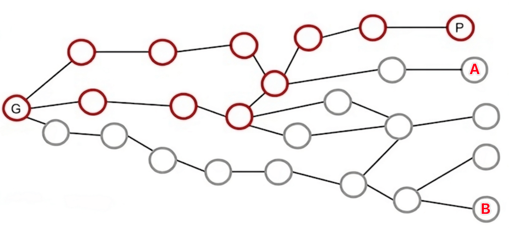

## 比特币闪电网络概览

### 概述与愿景

闪电网络是运行在比特币的区块链之上的一种支付协议。其目的是为了提供即时、高效的交易体验，解决比特币扩容的问题。闪电网络是历史悠久的最为知名的“第二层（Layer2）”解决方案之一，它的愿景是开创一个能够为大规模用户提供高速、低成本的比特币交易环境。

### 技术原理

闪电网络的工作原理主要基于"支付通道"的概念。

1. 两个愿意进行频繁交易的参与者可以在区块链上创建一个多签名钱包，只有他们二人在交易中共同签名才能进行转账。他们把自己的比特币存入这个多签钱包，然后开始在链下进行交易。
2. 每次链下的交易实质是彼此交换数字签名，并构造新的有效的交易，新交易会根据交易金额分配支付通道的余额。但是此时二人不会将交易广播到比特币网络。二人会分别持有构造的交易，并等待下一次交易。
3. 下一次交易时，双方会更新持有的交易副本。再次构造新的有效交易，新交易同样会分配支付通道中的余额。
4. 通道关闭。通道可单方面关闭或两方协商一致后关闭交易通道。当交易被广播到区块链中且交易确认后。通道即关闭。

#### 技术细节

闪电网络技术的一个核心在于双方每次更新最新交易后，如何避免历史交易被广播到区块上。其解决方式在于，每次交易后双方持有的交易并不相同，例如某笔关闭通道的交易是分配给A 1BTC，分配给B 1 BTC。两人持有的交易分别为：

A持有的交易

- 交易内容
  - 输入：A&B 多签钱包 2BTC
  - 输出1: B 1 BTC
  - 输出2：“锁定合约” 1 BTC（满足任意之一解锁条件可解锁）
    - 一定时间（即区块数）后，A可以提币
    - 提供秘密值，秘密值的哈希与合约中存储的值一致时，B能够提币
- 包含B的签名，A在签名后该交易便能够被广播到区块链上。

B持有的交易

- 交易内容
  - 输入：A&B 多签钱包 2BTC
  - 输出1: A 1 BTC
  - 输出2：“锁定合约” 1 BTC（满足任意之一解锁条件可解锁）
    - 一定时间（即区块数）后，B可以提币
    - 提供秘密值，秘密值的哈希与合约中存储的值一致时，A能够提币
- 包含A的签名，B在签名后该交易便能够被广播到区块链上。

> 准确的表述应为比特币脚本，“合约”的说法仅为了理解方便，但并不准确。

以A持有的交易为例，锁定合约中的钱“应属于”A，但无法被A立刻提取，需要等待合约中约定的时间(如一天为6*24 = 144 个块)，才能花费其中的金额。除此以外，锁定合约还有另一个解锁条件：由B提供一个**秘密值**。一旦B提供该秘密值，便可以立刻花费该交易。在这种情况下，A将无法获取支付通道内的任意资金。对B也是同理。因此，一旦对方得知该秘密值，A或B都不会再愿意广播历史交易。

而在链下的每次交易，A与B会交换彼此的秘密值，从而保证彼此只会广播最新交易。

可以看到，单方面关闭通道时，需要等待一段时间己方才可提币。如果不想要该等待期，则需要双方协商一致构造交易。

#### 技术优劣分析

##### 优势

1. 快速支付：无需等待区块链确认，可以做到近乎实时的支付。
2. 降低交易费用：因为大部分交易在链下处理，只有在最终结算时才提交到链上，最终在链上的交易只包括开启通道与关闭通道两笔交易。
3. 可扩展性：理论上而言，由于支付通道是纯链下且参与方允许仅有两方，理论上可以享有无限高的tps——只要不断增加支付通道数量并提高交易参与方的交易频次。受限于设备计算能力、参与方数量、网络延迟等条件，闪电网络的交易处理能力是有其上限的。闪电网络的可扩展性更接近于传统的互联网基础设施——当有更多的资源投入，如计算能力更强的节点、更多的支付通道（or锁仓量），闪电网络的处理能力都能进一步扩容。而这种可扩展性则是传统的区块链所不具备的。
4. **允许资产强制退出**：闪电网络中，花费资金需要支付通道的另一方在线。如果支付通道另一方处于无法交互的状态，用户也可以单方面广播交易并在锁定期后提币。

##### 劣势

###### 智能合约

闪电网络本身仅仅是作为支付通道存在，不具备更为复杂的合约功能。

###### 支付习惯

闪电网络的支付方式与用户直觉或用户习惯不一致：

- 双方在线要求：在闪电网络中，进行链下交易时，通常要求交易双方的节点都在线。这意味着，与信用卡或电子钱包等可以离线授权的支付方式不同，如果一方不在线，交易可能无法即时完成。这种实时在线的要求可能会对那些习惯于快速、无需双方同时在线确认的支付方式的用户造成不便。

- 支付通道的资金上限：在建立支付通道时，需要预先存入一定数量的比特币。支付通道的初始金额将决定用户在通道中可以发送或接收的最大金额。如果用户没有在通道中存入足够的比特币，他们将无法发送超过该金额的支付。同样也存在着用户只能发送金额而不能接收金额的情况。如果需要调整限额则需要重新建立支付通道。

- 通道管理：闪电网络用户需要管理多个支付通道，以确保他们有足够的流动性来进行交易。这可能包括定期打开和关闭通道，以及在不同的通道中重新分配资金。这种管理要求比传统的单一账户支付方式更为复杂，可能会对那些寻求简单支付解决方案的用户构成挑战。

- 路由和流动性：在闪电网络中，为了完成跨多个通道的支付，需要有足够的路由信息和流动性。用户可能需要依赖路由服务提供商来寻找最佳的支付路径。这与传统的支付系统不同，在那些系统中，用户通常不需要担心资金的路由问题。

这些支付方式形成了一定的使用门槛，但一定程度上也能被优秀的客户端软件设计所缓解。

###### 中心化风险

有一些意见认为闪电网络中存在着中心化风险：虽然支付通道能够以去中心化的方式运作，形成支付网络，但是实际部署中往往依赖于中心化的服务商（Lightning Service Provider）提供流动性与路由服务。这种担忧不无道理。用户往往与LSP直接形成支付通道，而一旦LSP下线（或存在系统性的错误），就可能造成大范围或局部的支付通道瘫痪（见[图](https://www.carlsterner.com/writing/resilience-and-decentralization)A or B）。但该问题某种程度上也存在于其他区块链系统中，如Infura一度占据了绝大多数以太坊的节点服务份额。这种风险会随着生态的进一步发展而缓解。

#### 安全性分析

闪电网络其安全性依赖于密码学与协议的安全性，而不依赖于可信第三方。用户永远有强制退出的选项，这也保证了用户资产的安全。
但同时为了避免交易另一方发布历史交易进行欺诈，客户端需要时刻监控区块链，确认交易对手没有将历史交易状态发布到链上。一般用户往往是难以做到的，这种情况下，用户需要将监控业务委托给第三方服务，这也被称作暸望塔。

闪电网络的安全性还依赖于比特币网络的安全性，如果比特币的安全性受到威胁，闪电网络同样会受到影响。例如，当比特币网络中出现大规模的审查攻击时（活性受到影响），将导致惩罚交易无法及时上链，这种场景下资产安全性也会受到影响。

### Total Value Locked (TVL)

2024/3/15: 4473 BTC

https://defillama.com/protocol/lightning-network

<iframe width="640px" height="360px" src="https://defillama.com/chart/protocol/lightning-network?denomination=BTC&usdInflows=false&theme=dark" title="DefiLlama" frameborder="0"></iframe>

### Resources

- [lighning network whitepaper](https://lightning.network/lightning-network-paper.pdf)
- [闪电网络的入账容量问题](https://www.panewslab.com/zh/articledetails/D58916299.html)
- [Lightning Service Provider](https://docs.lightning.engineering/the-lightning-network/liquidity/lightning-service-provider)
- [解读闪电网络，探寻比特币支付通道的前世今生](https://mp.weixin.qq.com/s/uu_S1EIY1w-hx0LWJu0egA)
- [【纯白矩阵直播】Ep9. 萨尔瓦多的实践--BTC闪电网络技术](https://www.bilibili.com/video/BV1bR4y1H7zs/)

## RGB

### 概述与愿景

RGB是一个建立在比特币区块链之上的智能合约平台，它通过客户端验证范式，实现了在比特币网络上运行智能合约的能力，同时保持了与闪电网络的兼容性。RGB的核心特点包括数据的链下存储、使用比特币脚本作为安全和所有权控制系统，以及通过“分片”技术实现的高可扩展性。该平台旨在提供一个超越传统以太坊类智能合约系统的解决方案，通过分离智能合约的发行者、所有者和状态演变的概念，为去中心化应用和数字资产管理提供了一个更加分层、可扩展、私密和安全的环境。

### 技术原理

#### 状态机复制

在介绍技术原理前，这里先介绍比特币，或者说绝大多数区块链都在应用的一个范式：通过状态机复制实现容错服务。这个范式的目标是解决多个副本的一致性问题，到实际的应用场景中则例如分布式数据库，再如这里讨论的区块链。而它的实现方式也非常简明：

1. 所有副本以某一状态作为初始态。
2. 在接收新的输入前，副本状态保持不变。接收到输入i后，副本会转换为新状态。且状态转换函数是确定性的，给定相同的副本状态与输入，副本的新状态是一致的。
3. 通过这样的方法，只要副本具有相同的初始状态s0，并保证每个副本的输入i0，i1，i2...in相同且顺序一致，那么所有副本的状态都能保持一致。

我们借用比特币的语境，重新阐释一下上面的解释：

> 这里我们使用“状态”代指比特币中的所有UTXO

1. 所有比特币客户端以创世区块作为初始状态。
2. 在接收到新的区块前，比特币账本的状态保持不变。接收到新交易后，账本会转换为新状态。且这一转换过程是确定性的，给定相同的账本状态与相同的交易，新的账本状态是一致的。
3. 通过这样的方法，只要所有比特币客户端都能以创世区块作为初始态，并以相同的顺序处理相同的交易i0，i1，i2...in，那么最终所有客户端所持有的账本状态是一致的。

而这里最核心的问题在于如何保证所有节点都能决定一批相同顺序的交易，换言之，即共识，这也是区块链抵御双花攻击的基础。

#### RGB原理

承接上文，RGB所做的，则是借助比特币的共识，通过链上承诺的方式，确定链下合约的初始态与输入的顺序，将其他几乎所有内容转移到链下，由客户端完成，这被RGB称为客户端验证（client-side-validation）。交易时，链下的客户端会验证相关的历史数据，根据链上提交的内容确认历史状态变化是否合法。并通过这种方式实现了智能合约的隐私性与可扩展性：非交易者只能在比特币上观察到承诺值，而无法得知具体的交易信息；智能合约之间可以以分片式的方式运行，从而实现了可扩展性。

<!-- 而具体到实现细节，RGB也做了非常多的工作。例如其设计中包含图灵完备的虚拟机AluVM -->
具体到实现细节上，RGB采用了特殊的状态转换方式（proof of publication）与一次性密封（Single-use-seals）实现客户端验证。

- [proof of publication](https://blackpaper.rgb.tech/consensus-layer/3.-client-side-validation/3.1.-proof-of-publication): 其核心思想是分布式系统中状态验证不需要由所有参与去全局执行，而只需涉及特定状态转换的各方进行验证。采用这种方法，状态转换并非发布到全局，而是保证相关参与方知晓后（如签名），被编码成一个简短的密码承诺。如下图，合约G的全局状态为所有红色与灰色的节点（代表某次历史交易），然而验证P的状态只需要与P相关的红色节点部分。

注意：发布前确认图片出处

- [一次性封装](https://blackpaper.rgb.tech/consensus-layer/3.-client-side-validation/3.2.-single-use-seals)：这一技术的实现相比其概念更易理解。对应于RGB的实现，这代表每次RGB交易对应着UTXO的花费，从而避免双花攻击。这也代表着，只有有权花费UTXO的用户才有与合约交互的可能，而在交易后，合约的访问权被转移给声明的其他UTXO的所有者（注意新UTXO不必为上一UTXO的输出）。

RGB本身为比特币这种UTXO-based区块链提供一套智能合约方案。你可以认为是RGB是扩展了比特币，提供了智能合约处理能力，也可以认为RGB是寄生在比特币上，借用了其共识。

### 技术优劣分析

#### 优势

RGB的优势

- 隐私性：链上不包含合约数据，仅包含承诺，交易方外无法得知合约的具体状态，甚至合约的参与方也无法得知合约的全局状态。
- 可扩展性：不同RGB合约间分片执行，互不影响。同时也提出了与闪电网络集成的方案，从而不受比特币主网tps限制。
- （复杂合约的）链上交易费用：RGB的合约交易数据存储在链下而非链上，链上所需的交易费用与合约逻辑无关。

#### 劣势

RGB方案为了保护隐私而选择了将合约数据交由客户端存储与验证，因此客户端的设计也成为了RGB协议可用性的核心。然而，RGB的设计思路也给客户端设计带来了重重困难：

- 数据交互：每次交易后，RGB合约状态的所有权将转移至新的UTXO。
- 用户间协议交互：如proof-of-publication所描述，状态转换需要保证相关参与方知晓后，被编码成一个简短的密码承诺，因此在一些场景下，用户与用户需要交互式地互动，获得他人的签名后构造承诺。一方面这需要双方同时在线，一方面这也增加了客户端的设计与使用难度。（详细说明可以参考官方提供的样例的state transfer部分：https://rgb.tech/power-user ）
- 交易验证的处理开销：每次交易时，客户端都要验证状态，当合约状态与交易次数增加时，验证开销可能会变得极为庞大。此外这一验证过程也需要验证比特币主网数据，因此也会增加本地的存储开销（本地保存）或一定的网络开销（与RPC节点或相关服务方交互）。

而此外，RGB相关的整体开发进展并不理想：开发工具也不算完善，例如RGB与闪电网络的集成存在一定困难，生态仍处于待发展状态。

### 安全性分析

RGB协议本身的安全性与比特币的安全性锚定，如果一次性封装对应的UTXO被花费且已被比特币网络确认，RGB协议也可以认为相关交易已被确认。

RGB的安全风险更多的在于数据可用性与智能合约安全——但这些问题在某种层面上更接近于工程问题。例如，当用户不慎丢失了智能合约中的历史数据，用户虽然能够花费UTXO，但却不能再去访问RGB中的智能合约了。而同样，如果智能合约的承诺或状态转移不合法，但由于链上仅包含承诺而不包含校验，当UTXO被花费后，用户将无法再次访问智能合约。

### 相关资源

- [RGB Blackpaper](https://blackpaper.rgb.tech/)
- https://www.coinex.com/en/blog/3654-a-brief-analysis-of-rgb-a-scalable-confidential-smart-contract-protocol-built-on-bitcoin

## RGB++

### 概述与愿景

RGB++由Nervos CKB的Cipher提出。Nervos CKB 是一条基于UTXO模型（CKB中称之为Cell）的公链。RGB++ 是一个基于 RGB 的扩展协议，它通过同构绑定将比特币 UTXO 映射到 Nervos CKB 的 Cell 上，并利用 CKB 链和 Bitcoin 链上的脚本约束来验证状态计算的正确性和变更所有权的有效性。RGB++ 希望解决原 RGB 协议在实际落地中的技术问题，将客户端的工作转由 CKB 链承担。

### 技术框架

单笔交易的流程

（直接copy）

### 讨论

#### RGB++ 是否应当被视作比特币的扩容方案

首先需要考虑的是，那就是RGB++是否能被当作比特币的扩容方案？或者换句话说，如果我们将RGB++当作比特币的扩容方案，那么究竟是哪里让它能被视作是比特币的扩容方案？为了思考这个问题，我们可以这样考虑：

RGB++中将CKB作为了RGB的客户端，但RGB方案本身并不依赖于比特币本身。RGB方案同样可以直接将承诺、甚至直接将状态转移本身提交到CKB。或者我们可以假定存在另一个名为“RGB--”的方案：它不提交承诺到BTC，而是直接将状态转移提交到CKB公开：

||RGB|“RGB--”（假想）|RGB++|
|-|-|-|-|
|提交承诺|BTC|不提交（或可直接从CKB算出）|BTC|
|提交状态（以及转移）|客户端|CKB|CKB|
|读取状态|客户端|CKB|CKB|
|状态验证|客户端|CKB合约限制|CKB合约限制、BTC链上验证|
|状态转移排序|BTC|CKB|BTC & CKB|

“RGB--”毫无疑问不是比特币扩容方案。不过在这种情况下，我们貌似可以借助RGB+“RGB--”拼起来实现与RGB++等同的逻辑，但容易发现并非如此：可以在RGB与RGB--上提交不对应的承诺与状态转移，而RGB++会借用BTC的轻节点验证BTC上是否存在对应承诺，这就带来了根本性的不同。RGB++中虽然也会将交易提交到CKB链，但有效的状态转移则需要在BTC上存在对应的承诺。对于RGB这类链下计算方案而言，它们不需要利用比特币脚本进行交互，因此无需签名，也无需跨链桥的信任，能够仅靠一个读取比特币状态的轻客户端完成扩容。这一范式也被是ordinals以及铭文所采用。

#### global state 带来的安全风险

RGB++的先承诺后公开的方案带来了一点小问题，那就是BTC的承诺全序与CKB上的状态变更全序是不一致的：假设BTC上先后有两个承诺A、B被先后公开，但CKB上的公开顺序可以为B、A。对于**原始的**RGB设计而言，这是完全ok的，RGB的proof-of-publication设计中，只需要保证单一路径上状态转换的全序性即可。

RGB++中为了增强合约的表达能力，引入了global-state cell，RGB++的白皮书“共享状态与无主合约”中提到了这一点：

> 考虑 CKB 上存在一个全局状态的 Cell，用来管理多用户共享的状态。...全局状态由无主合约管理，所谓无主合约指的是任何人在满足合约的约束前提下都可以对状态进行变更，而不要求指定的数字签名提供方进行变更。...
>
> 这里的平庸实现指的是 Global-state cell 有被其他用户占用的风险，这样 CKB TX 就会因为指定的 Global state utxo 不存在而无法成立。...
>
> 为了解决上述问题，我们引入了 Intent Cell 作为中介。用户将自己希望执行的动作确定性地写入 Intent Cell，后者则可以通过第三方聚合器的协作与全局状态 Cell 交互，批量将多方的 intent 进行计算，并将交互结果合并到标准的 shadow cell 上。

而一旦引入了global-state等设计，则会改变这一点，导致交易A与B的公开顺序对执行结果造成影响，考虑下面描述的场景（图参考上图）：

1. 交易A与B的承诺都已经先后上链BTC。
2. 但交易A对应的CKB交易因为某些原因一直未能上链（例如CKB链上的审查攻击）。
3. B交易在执行后已经对global state进行了修改。
4. 交易A上链CKB后A交易很可能产生不同的执行结果甚至导致执行失败，造成资产丢失等后果。

而白皮书中提出的Intent Cell方法并不足以解决这个问题。Intent Cell能保证的是提交到CKB的交易能通过验证，但却无法确保A与B都能被即时提交到CKB链上。（这也是先承诺后公开的一类方案需要考虑的重点）。在原始RGB方案中，只要客户端的正确构造了状态转换与承诺，合约就能够顺利运作，而RGB++中，在比特币上先提交的承诺的有效性却反过来被CKB控制了，因此为RGB引入global-state cell这一设计很有可能不是一个好想法。

### 相关资源

- [RGB++ Protocol Light Paper](https://talk.nervos.org/t/rgb-protocol-light-paper/7733)
- https://github.com/ckb-cell/RGBPlusPlus-design/blob/main/docs/locscript-design-prd-cn.md
